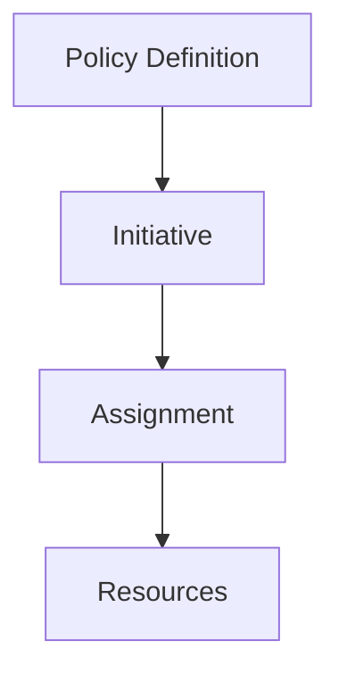

# 📜 Azure Policy

> Governance and compliance enforcement using Azure Policy.

---

# 📚 Table of Contents

- [� Azure Policy](#-azure-policy)
- [📚 Table of Contents](#-table-of-contents)
- [📌 Overview](#-overview)
- [🏗️ Azure Policy Architecture](#️-azure-policy-architecture)
- [🔑 Core Concepts](#-core-concepts)
- [⚙️ Policy Administration](#️-policy-administration)
  - [Common Policy Actions](#common-policy-actions)
- [📊 Common Policy Scenarios](#-common-policy-scenarios)
- [🧪 Azure CLI Examples](#-azure-cli-examples)
  - [Assign Policy](#assign-policy)
  - [View Compliance](#view-compliance)
- [🧪 PowerShell Examples](#-powershell-examples)
  - [List Policy Assignments](#list-policy-assignments)
- [🚨 Common Issues](#-common-issues)
  - [Resource Deployment Blocked](#resource-deployment-blocked)
    - [Possible Causes](#possible-causes)
    - [Troubleshooting](#troubleshooting)
  - [Non-Compliant Resources](#non-compliant-resources)
    - [Common Causes](#common-causes)
- [✅ Best Practices](#-best-practices)
- [📖 References](#-references)

---

# 📌 Overview

Azure Policy enforces organizational standards and compliance requirements across Azure resources.

Administrators use Azure Policy to:

- Enforce governance
- Restrict deployments
- Audit resources
- Apply compliance standards
- Standardize configurations

---

# 🏗️ Azure Policy Architecture



---

# 🔑 Core Concepts

| Component | Description |
|---|---|
| Policy Definition | Rule definition |
| Initiative | Group of policies |
| Assignment | Policy applied to scope |
| Compliance | Resource evaluation state |

---

# ⚙️ Policy Administration

## Common Policy Actions

- Restrict resource locations
- Require tags
- Enforce encryption
- Audit configurations
- Deny non-compliant deployments

---

# 📊 Common Policy Scenarios

| Scenario | Example |
|---|---|
| Allowed Regions | Restrict deployments |
| Mandatory Tags | Cost tracking |
| Enforce HTTPS | Security |
| Restrict VM SKUs | Cost optimization |

---

# 🧪 Azure CLI Examples

## Assign Policy

```bash
az policy assignment create \
  --name "AllowedLocations" \
  --policy "/providers/Microsoft.Authorization/policyDefinitions/<POLICY-ID>"
```

## View Compliance

```bash
az policy state list
```

---

# 🧪 PowerShell Examples

## List Policy Assignments

```powershell
Get-AzPolicyAssignment
```

---

# 🚨 Common Issues

## Resource Deployment Blocked

### Possible Causes

- Deny policy
- Required tags missing
- Restricted location

### Troubleshooting

```text
Azure Policy
→ Compliance
```

---

## Non-Compliant Resources

### Common Causes

- Manual configuration drift
- Legacy deployments
- Missing remediation tasks

---

# ✅ Best Practices

- Start with audit policies first
- Use initiatives for organization
- Apply policies at management group scope
- Document governance standards
- Avoid overly restrictive policies initially

---

# 📖 References

- [Azure Policy Documentation](https://learn.microsoft.com/en-us/azure/governance/policy/overview?utm_source=chatgpt.com)
- [Azure Policy Definitions](https://learn.microsoft.com/en-us/azure/governance/policy/samples/?utm_source=chatgpt.com)
- [Azure Policy Initiatives](https://learn.microsoft.com/en-us/azure/governance/policy/concepts/initiative-definition-structure?utm_source=chatgpt.com)

---