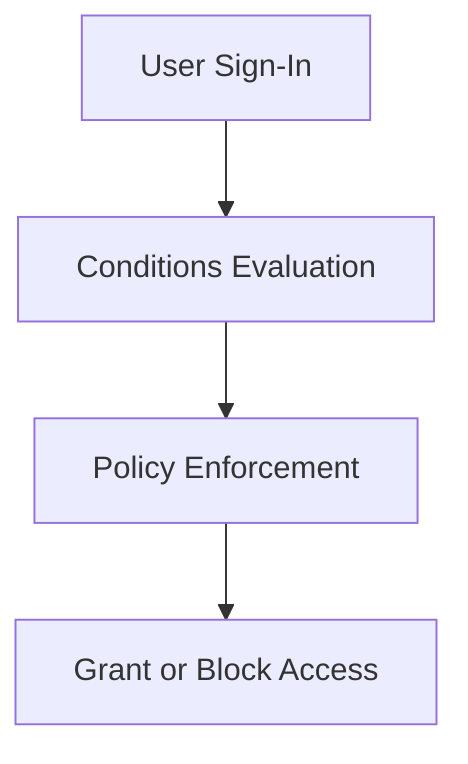

# 🛡️ Conditional Access

> Protect Azure identities and applications using Conditional Access policies.

---

# 📚 Table of Contents

- [�️ Conditional Access](#️-conditional-access)
- [📚 Table of Contents](#-table-of-contents)
- [📌 Overview](#-overview)
- [🏗️ Conditional Access Architecture](#️-conditional-access-architecture)
- [🔑 Core Concepts](#-core-concepts)
- [⚙️ Policy Components](#️-policy-components)
  - [Conditions](#conditions)
  - [Grant Controls](#grant-controls)
- [📊 Common Scenarios](#-common-scenarios)
- [🧪 Azure Administration Examples](#-azure-administration-examples)
  - [Example Policy](#example-policy)
  - [Recommended Baseline Policies](#recommended-baseline-policies)
- [🚨 Common Issues](#-common-issues)
  - [User Locked Out](#user-locked-out)
    - [Possible Causes](#possible-causes)
    - [Troubleshooting](#troubleshooting)
  - [Legacy Authentication Still Allowed](#legacy-authentication-still-allowed)
    - [Common Causes](#common-causes)
- [✅ Best Practices](#-best-practices)
- [📖 References](#-references)

---

# 📌 Overview

Conditional Access evaluates sign-in conditions and enforces security controls.

Microsoft Entra ID uses Conditional Access to:

- Require MFA
- Block risky sign-ins
- Restrict device access
- Protect cloud applications
- Enforce Zero Trust principles

---

# 🏗️ Conditional Access Architecture



---

# 🔑 Core Concepts

| Component | Description |
|---|---|
| User Assignment | Targeted users/groups |
| Cloud Apps | Protected applications |
| Conditions | Risk, location, device |
| Grant Controls | MFA, compliant device |
| Session Controls | Session restrictions |

---

# ⚙️ Policy Components

## Conditions

- User Risk
- Sign-In Risk
- Device Platform
- Location
- Client Applications

---

## Grant Controls

| Control | Purpose |
|---|---|
| Require MFA | Strong authentication |
| Require Compliant Device | Device security |
| Block Access | Deny authentication |

---

# 📊 Common Scenarios

| Scenario | Security Goal |
|---|---|
| Require MFA for Admins | Protect privileged accounts |
| Block Legacy Authentication | Prevent insecure protocols |
| Restrict External Locations | Reduce attack surface |
| Require Hybrid Joined Devices | Secure corporate access |

---

# 🧪 Azure Administration Examples

## Example Policy

```text
Users:
- Global Administrators

Cloud Apps:
- All Cloud Apps

Grant Controls:
- Require MFA
```

---

## Recommended Baseline Policies

- Require MFA for admins
- Block legacy authentication
- Protect privileged roles
- Require MFA for external access

---

# 🚨 Common Issues

## User Locked Out

### Possible Causes

- Misconfigured policy
- MFA failure
- Location restriction
- Device compliance issue

### Troubleshooting

```text
Entra ID
→ Sign-in Logs
→ Conditional Access
```

---

## Legacy Authentication Still Allowed

### Common Causes

- Excluded applications
- Incomplete policy scope
- SMTP authentication enabled

---

# ✅ Best Practices

- Start in report-only mode
- Test policies with pilot groups
- Always exclude break-glass accounts
- Require MFA for privileged roles
- Block legacy authentication
- Monitor sign-in logs regularly

---

# 📖 References

- [Conditional Access Documentation](https://learn.microsoft.com/en-us/entra/identity/conditional-access/overview?utm_source=chatgpt.com)
- [Conditional Access Best Practices](https://learn.microsoft.com/en-us/entra/identity/conditional-access/concept-conditional-access-best-practices?utm_source=chatgpt.com)
- [Zero Trust Guidance](https://learn.microsoft.com/en-us/security/zero-trust/?utm_source=chatgpt.com)

---