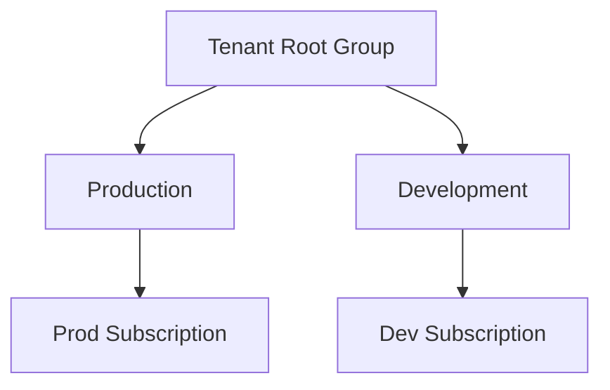

# 🏛️ Management Groups

> Organize and govern Azure environments at enterprise scale using Management Groups.

---

# 📚 Table of Contents

- [🏛️ Management Groups](#️-management-groups)
- [📚 Table of Contents](#-table-of-contents)
- [📌 Overview](#-overview)
- [🏗️ Management Group Hierarchy](#️-management-group-hierarchy)
- [🔑 Core Concepts](#-core-concepts)
- [⚙️ Management Group Administration](#️-management-group-administration)
  - [Common Tasks](#common-tasks)
- [📊 Governance Scenarios](#-governance-scenarios)
- [🧪 Azure CLI Examples](#-azure-cli-examples)
  - [Create Management Group](#create-management-group)
  - [List Management Groups](#list-management-groups)
- [🧪 PowerShell Examples](#-powershell-examples)
  - [Create Management Group](#create-management-group-1)
- [🚨 Common Issues](#-common-issues)
  - [Subscription Cannot Move](#subscription-cannot-move)
    - [Possible Causes](#possible-causes)
  - [RBAC Not Inheriting](#rbac-not-inheriting)
    - [Troubleshooting](#troubleshooting)
- [✅ Best Practices](#-best-practices)
- [📖 References](#-references)

---

# 📌 Overview

Management Groups provide hierarchical organization for Azure subscriptions.

They allow administrators to:

- Apply governance at scale
- Organize environments
- Apply RBAC inheritance
- Assign Azure Policies centrally
- Standardize enterprise environments

---

# 🏗️ Management Group Hierarchy



---

# 🔑 Core Concepts

| Component | Description |
|---|---|
| Tenant Root Group | Highest hierarchy level |
| Management Group | Organizational container |
| Subscription | Billing boundary |
| Inheritance | Policies and RBAC flow downward |

---

# ⚙️ Management Group Administration

## Common Tasks

- Create management groups
- Move subscriptions
- Assign RBAC
- Apply Azure Policy
- Organize enterprise environments

---

# 📊 Governance Scenarios

| Scenario | Example |
|---|---|
| Environment Separation | Prod / Dev / Test |
| Department Organization | Finance / HR / IT |
| Compliance Isolation | PCI / HIPAA |
| Regional Governance | US / Europe |

---

# 🧪 Azure CLI Examples

## Create Management Group

```bash
az account management-group create \
  --name Production
```

## List Management Groups

```bash
az account management-group list
```

---

# 🧪 PowerShell Examples

## Create Management Group

```powershell
New-AzManagementGroup `
-GroupName "Production"
```

---

# 🚨 Common Issues

## Subscription Cannot Move

### Possible Causes

- Insufficient permissions
- Policy conflict
- Existing locks

---

## RBAC Not Inheriting

### Troubleshooting

Verify:
- Scope hierarchy
- Parent assignments
- Deny assignments

---

# ✅ Best Practices

- Use consistent hierarchy design
- Separate production environments
- Apply governance centrally
- Avoid excessive nesting
- Use management groups for policy inheritance

---

# 📖 References

- [Azure Management Groups Documentation](https://learn.microsoft.com/en-us/azure/governance/management-groups/overview?utm_source=chatgpt.com)
- [Organize Resources with Management Groups](https://learn.microsoft.com/en-us/azure/governance/management-groups/how-to/protect-resource-hierarchy?utm_source=chatgpt.com)

---