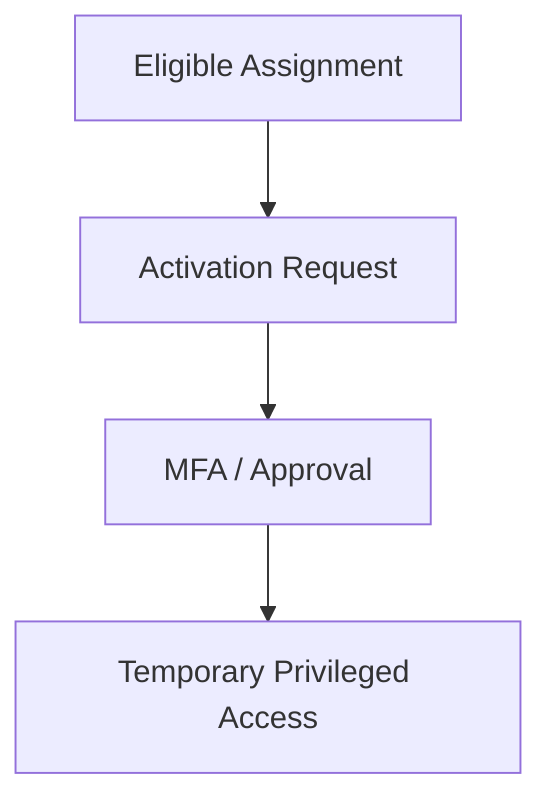

# 👑 Privileged Identity Management (PIM)

> Secure and manage privileged access using Microsoft Entra Privileged Identity Management.

---

# 📚 Table of Contents

- [� Privileged Identity Management (PIM)](#-privileged-identity-management-pim)
- [📚 Table of Contents](#-table-of-contents)
- [📌 Overview](#-overview)
- [🏗️ PIM Architecture](#️-pim-architecture)
- [🔑 Core Concepts](#-core-concepts)
- [⚙️ PIM Configuration](#️-pim-configuration)
  - [Common Configuration Tasks](#common-configuration-tasks)
- [📊 PIM Role Types](#-pim-role-types)
- [🧪 Azure Administration Examples](#-azure-administration-examples)
  - [PIM Activation Workflow](#pim-activation-workflow)
  - [Recommended PIM Controls](#recommended-pim-controls)
- [🚨 Common Issues](#-common-issues)
  - [Role Activation Failed](#role-activation-failed)
    - [Possible Causes](#possible-causes)
    - [Troubleshooting](#troubleshooting)
  - [User Cannot See Eligible Roles](#user-cannot-see-eligible-roles)
    - [Common Causes](#common-causes)
- [✅ Best Practices](#-best-practices)
- [📖 References](#-references)

---

# 📌 Overview

Privileged Identity Management (PIM) provides just-in-time privileged access to Azure resources and Microsoft Entra roles.

PIM helps organizations:

- Reduce standing privileges
- Monitor privileged activity
- Require approval workflows
- Enforce MFA
- Audit elevated access

---

# 🏗️ PIM Architecture



---

# 🔑 Core Concepts

| Component | Description |
|---|---|
| Eligible Role | Role available for activation |
| Active Role | Currently assigned role |
| Activation | Temporary elevation |
| Approval Workflow | Access approval process |
| Access Review | Periodic access validation |

---

# ⚙️ PIM Configuration

## Common Configuration Tasks

- Configure eligible assignments
- Enable approval workflows
- Configure activation duration
- Require MFA
- Configure notifications

---

# 📊 PIM Role Types

| Role Scope | Example |
|---|---|
| Entra Roles | Global Administrator |
| Azure RBAC Roles | Contributor |
| Group Roles | Privileged Groups |

---

# 🧪 Azure Administration Examples

## PIM Activation Workflow

```text
User
→ Activate Role
→ MFA Verification
→ Approval
→ Temporary Access Granted
```

---

## Recommended PIM Controls

- Require MFA
- Require justification
- Limit activation duration
- Enable approval for critical roles

---

# 🚨 Common Issues

## Role Activation Failed

### Possible Causes

- MFA issue
- Missing approval
- License issue
- Activation duration restriction

### Troubleshooting

```text
Entra ID
→ PIM
→ Audit History
```

---

## User Cannot See Eligible Roles

### Common Causes

- Incorrect assignment scope
- Role assignment not eligible
- PIM licensing issue

---

# ✅ Best Practices

- Use eligible instead of permanent assignments
- Limit activation time
- Enable approval workflows
- Audit privileged access regularly
- Protect break-glass accounts separately
- Use PIM for all privileged roles

---

# 📖 References

- [Microsoft Entra PIM Documentation](https://learn.microsoft.com/en-us/entra/id-governance/privileged-identity-management/?utm_source=chatgpt.com)
- [PIM Best Practices](https://learn.microsoft.com/en-us/entra/id-governance/privileged-identity-management/pim-deployment-plan?utm_source=chatgpt.com)
- [Azure RBAC Documentation](https://learn.microsoft.com/en-us/azure/role-based-access-control/overview?utm_source=chatgpt.com)

---