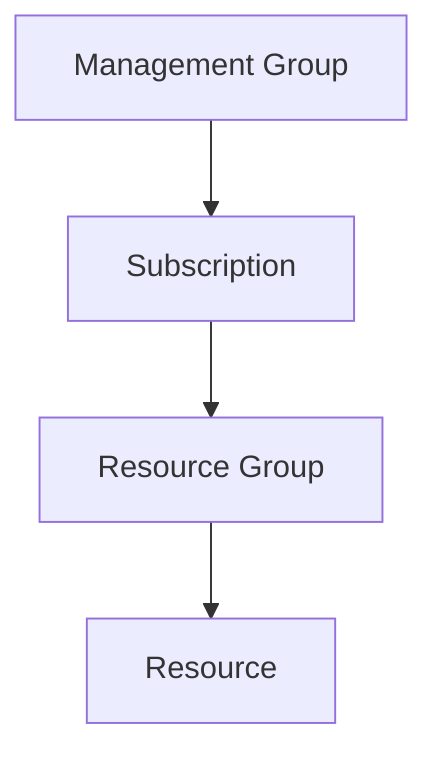

# 🔐 Azure RBAC

> Role-Based Access Control (RBAC) administration in Azure.

---

# 📚 Table of Contents

- [� Azure RBAC](#-azure-rbac)
- [📚 Table of Contents](#-table-of-contents)
- [📌 Overview](#-overview)
- [🏗️ RBAC Architecture](#️-rbac-architecture)
- [🔑 Core Components](#-core-components)
- [📊 Built-in Roles](#-built-in-roles)
- [⚙️ Role Assignments](#️-role-assignments)
  - [Scope Levels](#scope-levels)
- [🧪 Azure CLI Examples](#-azure-cli-examples)
  - [Assign Contributor Role](#assign-contributor-role)
  - [List Role Assignments](#list-role-assignments)
- [🧪 PowerShell Examples](#-powershell-examples)
  - [Assign RBAC Role](#assign-rbac-role)
- [🚨 Common Issues](#-common-issues)
  - [Access Denied Despite RBAC Assignment](#access-denied-despite-rbac-assignment)
    - [Possible Causes](#possible-causes)
  - [User Cannot See Subscription](#user-cannot-see-subscription)
    - [Troubleshooting](#troubleshooting)
- [✅ Best Practices](#-best-practices)
- [📖 References](#-references)

---

# 📌 Overview

Azure RBAC controls access to Azure resources using role assignments.

RBAC determines:

- Who can access resources
- What actions they can perform
- Which scope applies

---

# 🏗️ RBAC Architecture



RBAC inheritance flows downward.

---

# 🔑 Core Components

| Component | Description |
|---|---|
| Security Principal | User, Group, Service Principal |
| Role Definition | Permissions |
| Scope | Where access applies |
| Role Assignment | Links principal + role + scope |

---

# 📊 Built-in Roles

| Role | Purpose |
|---|---|
| Owner | Full access |
| Contributor | Manage resources |
| Reader | Read-only access |
| User Access Administrator | Manage RBAC |

---

# ⚙️ Role Assignments

## Scope Levels

- Management Group
- Subscription
- Resource Group
- Resource

---

# 🧪 Azure CLI Examples

## Assign Contributor Role

```bash
az role assignment create \
  --assignee john@contoso.com \
  --role Contributor \
  --resource-group Production-RG
```

## List Role Assignments

```bash
az role assignment list --all
```

---

# 🧪 PowerShell Examples

## Assign RBAC Role

```powershell
New-AzRoleAssignment `
-ObjectId "<USER-ID>" `
-RoleDefinitionName "Reader" `
-ResourceGroupName "Production-RG"
```

---

# 🚨 Common Issues

## Access Denied Despite RBAC Assignment

### Possible Causes

- Wrong scope
- Inheritance issue
- Deny assignment
- PIM not activated

---

## User Cannot See Subscription

### Troubleshooting

```text
Subscription
→ Access Control (IAM)
```

Verify:
- Reader role
- Subscription visibility
- Tenant association

---

# ✅ Best Practices

- Use groups instead of direct assignments
- Follow least privilege
- Avoid excessive Owner assignments
- Audit privileged access regularly
- Use PIM for elevated permissions

---

# 📖 References

- [Azure RBAC Documentation](https://learn.microsoft.com/en-us/azure/role-based-access-control/?utm_source=chatgpt.com)
- [Built-in Azure Roles](https://learn.microsoft.com/en-us/azure/role-based-access-control/built-in-roles?utm_source=chatgpt.com)
- [RBAC Best Practices](https://learn.microsoft.com/en-us/azure/role-based-access-control/best-practices?utm_source=chatgpt.com)

---