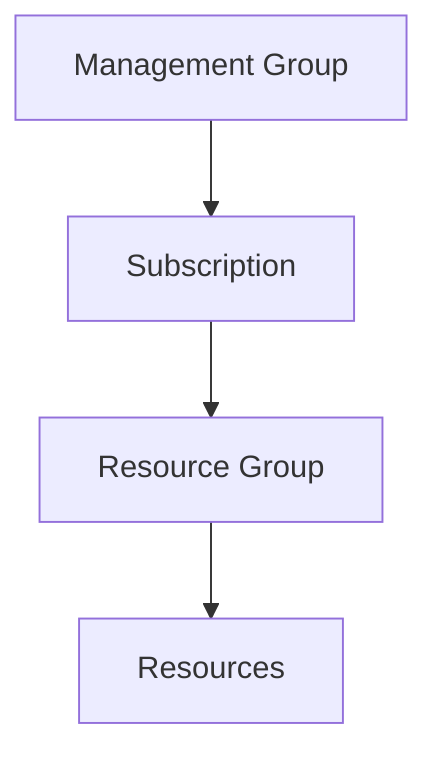

# 🏢 Subscriptions Management

> Azure subscription administration and governance.

---

# 📚 Table of Contents

- [🏢 Subscriptions Management](#-subscriptions-management)
- [📚 Table of Contents](#-table-of-contents)
- [📌 Overview](#-overview)
- [🏗️ Subscription Hierarchy](#️-subscription-hierarchy)
- [🔑 Core Concepts](#-core-concepts)
- [⚙️ Subscription Administration](#️-subscription-administration)
  - [Common Administrative Tasks](#common-administrative-tasks)
- [📊 Billing Scopes](#-billing-scopes)
- [🧪 Azure CLI Examples](#-azure-cli-examples)
  - [List Subscriptions](#list-subscriptions)
  - [Change Subscription](#change-subscription)
- [🧪 PowerShell Examples](#-powershell-examples)
  - [View Subscription](#view-subscription)
  - [Set Context](#set-context)
- [🚨 Common Issues](#-common-issues)
  - [Subscription Not Visible](#subscription-not-visible)
    - [Possible Causes](#possible-causes)
    - [Troubleshooting](#troubleshooting)
  - [Resource Provider Not Registered](#resource-provider-not-registered)
    - [Example](#example)
- [✅ Best Practices](#-best-practices)
- [📖 References](#-references)

---

# 📌 Overview

Azure subscriptions provide:

- Billing boundaries
- Resource isolation
- Access control scope
- Policy enforcement boundaries

Organizations commonly use multiple subscriptions for:

- Production
- Development
- Testing
- Security isolation
- Department separation

---

# 🏗️ Subscription Hierarchy



---

# 🔑 Core Concepts

| Concept | Description |
|---|---|
| Subscription | Billing and management container |
| Tenant | Entra ID instance |
| Resource Group | Logical resource organization |
| Management Group | Governance hierarchy |

---

# ⚙️ Subscription Administration

## Common Administrative Tasks

- Move subscriptions
- Configure RBAC
- Apply Azure Policy
- Manage resource providers
- Monitor spending
- Configure budgets

---

# 📊 Billing Scopes

| Scope | Usage |
|---|---|
| Billing Account | Enterprise billing |
| Subscription | Resource billing |
| Resource Group | Logical grouping |

---

# 🧪 Azure CLI Examples

## List Subscriptions

```bash
az account list --output table
```

## Change Subscription

```bash
az account set \
  --subscription "Production-Subscription"
```

---

# 🧪 PowerShell Examples

## View Subscription

```powershell
Get-AzSubscription
```

## Set Context

```powershell
Set-AzContext `
-Subscription "Production-Subscription"
```

---

# 🚨 Common Issues

## Subscription Not Visible

### Possible Causes

- RBAC issue
- Wrong tenant
- Disabled subscription

### Troubleshooting

```bash
az account show
```

---

## Resource Provider Not Registered

### Example

```bash
az provider register \
  --namespace Microsoft.Compute
```

---

# ✅ Best Practices

- Separate environments by subscription
- Apply governance policies consistently
- Use naming standards
- Monitor budgets and costs
- Limit Owner role assignments

---

# 📖 References

- [Azure Subscriptions Documentation](https://learn.microsoft.com/en-us/azure/cost-management-billing/manage/create-subscription?utm_source=chatgpt.com)
- [Azure Management Groups Documentation](https://learn.microsoft.com/en-us/azure/governance/management-groups/overview?utm_source=chatgpt.com)
- [Azure Cost Management Documentation](https://learn.microsoft.com/en-us/azure/cost-management-billing/?utm_source=chatgpt.com)

---