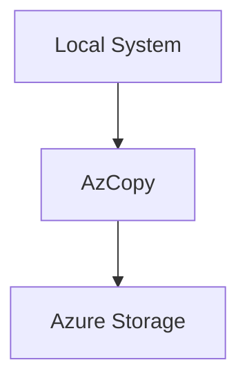

# 🚀 AzCopy

> High-performance Azure Storage data transfer utility for enterprise workloads.

---

# 📚 Table of Contents

- [� AzCopy](#-azcopy)
- [📚 Table of Contents](#-table-of-contents)
- [📌 Overview](#-overview)
- [🏗️ AzCopy Architecture](#️-azcopy-architecture)
- [🔑 Core Concepts](#-core-concepts)
- [⚙️ Installation](#️-installation)
  - [Download AzCopy](#download-azcopy)
- [🧪 Common Operations](#-common-operations)
- [🧪 AzCopy Examples](#-azcopy-examples)
  - [Upload File](#upload-file)
  - [Upload Directory](#upload-directory)
  - [Synchronize Data](#synchronize-data)
  - [Download Blob](#download-blob)
- [🚨 Common Issues](#-common-issues)
  - [Authentication Failure](#authentication-failure)
    - [Possible Causes](#possible-causes)
  - [Slow Transfer Speeds](#slow-transfer-speeds)
    - [Common Causes](#common-causes)
  - [Sync Deleting Files Unexpectedly](#sync-deleting-files-unexpectedly)
    - [Warning](#warning)
- [✅ Best Practices](#-best-practices)
- [📖 References](#-references)

---

# 📌 Overview

AzCopy is a command-line utility optimized for high-performance data transfers into and out of Azure Storage.

Common use cases:

- Blob uploads
- Blob downloads
- Storage migrations
- Backup transfers
- Bulk synchronization

---

# 🏗️ AzCopy Architecture



---

# 🔑 Core Concepts

| Component | Description |
|---|---|
| Copy | One-time transfer |
| Sync | Incremental synchronization |
| SAS Authentication | Delegated access |
| Recursive Transfer | Folder hierarchy copy |

---

# ⚙️ Installation

## Download AzCopy

- [AzCopy Download Documentation](https://learn.microsoft.com/en-us/azure/storage/common/storage-use-azcopy-v10?utm_source=chatgpt.com)

---

# 🧪 Common Operations

| Operation | Example |
|---|---|
| Upload Files | Local → Blob |
| Download Files | Blob → Local |
| Sync Data | Incremental copy |
| Cross-Region Migration | Blob → Blob |

---

# 🧪 AzCopy Examples

## Upload File

```bash
azcopy copy "backup.zip" "https://storage.blob.core.windows.net/backups?<SAS>"
```

## Upload Directory

```bash
azcopy copy "/data" "https://storage.blob.core.windows.net/backups?<SAS>" --recursive
```

## Synchronize Data

```bash
azcopy sync "/data" "https://storage.blob.core.windows.net/backups?<SAS>"
```

## Download Blob

```bash
azcopy copy "https://storage.blob.core.windows.net/backups?<SAS>" "/downloads"
```

---

# 🚨 Common Issues

## Authentication Failure

### Possible Causes

- Expired SAS token
- Invalid permissions
- Incorrect URL

---

## Slow Transfer Speeds

### Common Causes

- Bandwidth limitation
- Large file fragmentation
- Firewall inspection
- Regional latency

---

## Sync Deleting Files Unexpectedly

### Warning

> [!WARNING]
> `azcopy sync` can delete destination files depending on flags used.

---

# ✅ Best Practices

- Use SAS tokens with minimal permissions
- Use recursive uploads carefully
- Monitor large transfers
- Validate synchronization jobs
- Use private endpoints for secure transfers
- Avoid long-lived SAS tokens

---

# 📖 References

- [AzCopy Documentation](https://learn.microsoft.com/en-us/azure/storage/common/storage-use-azcopy-v10?utm_source=chatgpt.com)
- [AzCopy Optimization Guide](https://learn.microsoft.com/en-us/azure/storage/common/storage-use-azcopy-optimize?utm_source=chatgpt.com)
- [Azure Storage Security Recommendations](https://learn.microsoft.com/en-us/azure/storage/common/security-recommendations?utm_source=chatgpt.com)

---