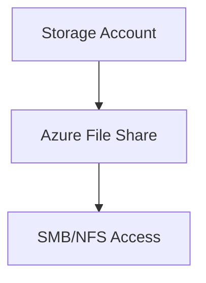

# 📂 Azure Files

> Enterprise SMB file shares using Azure Files.

---

# 📚 Table of Contents

- [� Azure Files](#-azure-files)
- [📚 Table of Contents](#-table-of-contents)
- [📌 Overview](#-overview)
- [🏗️ Azure Files Architecture](#️-azure-files-architecture)
- [🔑 Core Concepts](#-core-concepts)
- [⚙️ File Share Administration](#️-file-share-administration)
  - [Common Tasks](#common-tasks)
- [📊 Storage Tiers](#-storage-tiers)
- [🧪 Azure CLI Examples](#-azure-cli-examples)
  - [Create File Share](#create-file-share)
  - [List File Shares](#list-file-shares)
- [🧪 PowerShell Examples](#-powershell-examples)
  - [Create File Share](#create-file-share-1)
- [🚨 Common Issues](#-common-issues)
  - [Unable to Mount Share](#unable-to-mount-share)
    - [Possible Causes](#possible-causes)
  - [Slow SMB Performance](#slow-smb-performance)
    - [Common Causes](#common-causes)
- [✅ Best Practices](#-best-practices)
- [📖 References](#-references)

---

# 📌 Overview

Azure Files provides fully managed SMB and NFS file shares in Azure.

Common use cases:

- Lift-and-shift file servers
- Shared application storage
- User profiles
- Hybrid file storage

---

# 🏗️ Azure Files Architecture



---

# 🔑 Core Concepts

| Component | Description |
|---|---|
| File Share | SMB/NFS shared storage |
| SMB | Windows file protocol |
| NFS | Linux file protocol |
| Azure File Sync | Hybrid synchronization |

---

# ⚙️ File Share Administration

## Common Tasks

- Create file shares
- Configure quotas
- Mount SMB shares
- Configure backups
- Enable Azure File Sync

---

# 📊 Storage Tiers

| Tier | Usage |
|---|---|
| Premium | High-performance workloads |
| Transaction Optimized | General workloads |
| Hot | Frequently accessed |
| Cool | Archive scenarios |

---

# 🧪 Azure CLI Examples

## Create File Share

```bash
az storage share-rm create \
  --resource-group Production-RG \
  --storage-account prodstorage01 \
  --name sharedfiles
```

## List File Shares

```bash
az storage share-rm list \
  --storage-account prodstorage01
```

---

# 🧪 PowerShell Examples

## Create File Share

```powershell
New-AzRmStorageShare `
-ResourceGroupName "Production-RG" `
-StorageAccountName "prodstorage01" `
-Name "sharedfiles"
```

---

# 🚨 Common Issues

## Unable to Mount Share

### Possible Causes

- Port 445 blocked
- Firewall restriction
- Invalid credentials
- DNS issue

---

## Slow SMB Performance

### Common Causes

- Network latency
- Incorrect tier selection
- Large file operations

---

# ✅ Best Practices

- Use private endpoints
- Enable backups
- Restrict public access
- Use Azure File Sync for hybrid deployments
- Monitor SMB connectivity

---

# 📖 References

- [Azure Files Documentation](https://learn.microsoft.com/en-us/azure/storage/files/storage-files-introduction?utm_source=chatgpt.com)
- [Azure File Sync Documentation](https://learn.microsoft.com/en-us/azure/storage/file-sync/file-sync-introduction?utm_source=chatgpt.com)
- [Azure Files Networking Guide](https://learn.microsoft.com/en-us/azure/storage/files/storage-files-networking-overview?utm_source=chatgpt.com)

---