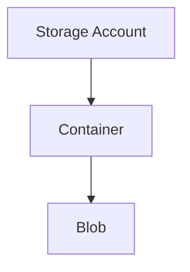

# 🪣 Blob Storage

> Object storage administration using Azure Blob Storage.

---

# 📚 Table of Contents

- [🪣 Blob Storage](#-blob-storage)
- [📚 Table of Contents](#-table-of-contents)
- [📌 Overview](#-overview)
- [🏗️ Blob Storage Architecture](#️-blob-storage-architecture)
- [🔑 Blob Types](#-blob-types)
- [⚙️ Blob Management](#️-blob-management)
  - [Common Tasks](#common-tasks)
- [📊 Access Tiers](#-access-tiers)
- [🧪 Azure CLI Examples](#-azure-cli-examples)
  - [Create Container](#create-container)
  - [Upload Blob](#upload-blob)
- [🧪 PowerShell Examples](#-powershell-examples)
  - [Upload Blob](#upload-blob-1)
- [🚨 Common Issues](#-common-issues)
  - [Blob Upload Failure](#blob-upload-failure)
    - [Possible Causes](#possible-causes)
  - [Slow Blob Performance](#slow-blob-performance)
    - [Common Causes](#common-causes)
- [✅ Best Practices](#-best-practices)
- [📖 References](#-references)

---

# 📌 Overview

Azure Blob Storage is optimized for storing unstructured data.

Common workloads include:

- Backups
- Logs
- Images
- Videos
- Data lakes
- Application data

---

# 🏗️ Blob Storage Architecture



---

# 🔑 Blob Types

| Blob Type | Usage |
|---|---|
| Block Blob | General storage |
| Append Blob | Logging |
| Page Blob | VHD files |

---

# ⚙️ Blob Management

## Common Tasks

- Create containers
- Upload blobs
- Configure access tiers
- Enable soft delete
- Configure lifecycle management

---

# 📊 Access Tiers

| Tier | Usage |
|---|---|
| Hot | Frequently accessed |
| Cool | Infrequent access |
| Archive | Long-term retention |

---

# 🧪 Azure CLI Examples

## Create Container

```bash
az storage container create \
  --name backups
```

## Upload Blob

```bash
az storage blob upload \
  --container-name backups \
  --file backup.zip \
  --name backup.zip
```

---

# 🧪 PowerShell Examples

## Upload Blob

```powershell
Set-AzStorageBlobContent `
-Container backups `
-File backup.zip
```

---

# 🚨 Common Issues

## Blob Upload Failure

### Possible Causes

- Authentication failure
- Network restriction
- Insufficient permissions
- Invalid container name

---

## Slow Blob Performance

### Common Causes

- Incorrect tier
- Large file fragmentation
- Network bottleneck

---

# ✅ Best Practices

- Use private containers
- Enable soft delete
- Configure lifecycle management
- Use RBAC instead of account keys
- Monitor storage transactions

---

# 📖 References

- [Azure Blob Storage Documentation](https://learn.microsoft.com/en-us/azure/storage/blobs/storage-blobs-overview?utm_source=chatgpt.com)
- [Blob Access Tiers](https://learn.microsoft.com/en-us/azure/storage/blobs/access-tiers-overview?utm_source=chatgpt.com)
- [Blob Lifecycle Management](https://learn.microsoft.com/en-us/azure/storage/blobs/lifecycle-management-overview?utm_source=chatgpt.com)

---