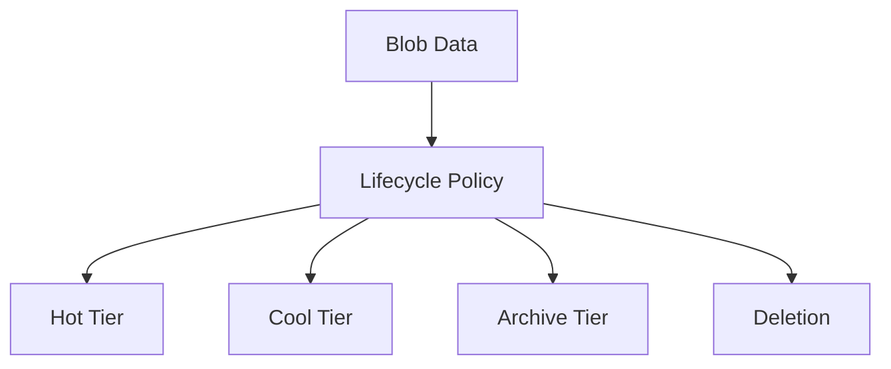

# ♻️ Lifecycle Management

> Automate Azure Storage data lifecycle and cost optimization.

---

# 📚 Table of Contents

- [♻️ Lifecycle Management](#️-lifecycle-management)
- [📚 Table of Contents](#-table-of-contents)
- [📌 Overview](#-overview)
- [🏗️ Lifecycle Management Architecture](#️-lifecycle-management-architecture)
- [🔑 Core Concepts](#-core-concepts)
- [⚙️ Lifecycle Policies](#️-lifecycle-policies)
  - [Common Actions](#common-actions)
- [📊 Common Scenarios](#-common-scenarios)
- [🧪 JSON Policy Example](#-json-policy-example)
- [🚨 Common Issues](#-common-issues)
  - [Policy Not Triggering](#policy-not-triggering)
    - [Possible Causes](#possible-causes)
  - [Unexpected Blob Deletion](#unexpected-blob-deletion)
    - [Common Causes](#common-causes)
- [✅ Best Practices](#-best-practices)
- [📖 References](#-references)

---

# 📌 Overview

Azure Storage Lifecycle Management automates blob data transitions and retention.

Organizations use lifecycle policies to:

- Reduce storage costs
- Archive old data
- Delete unused blobs
- Automate compliance retention

---

# 🏗️ Lifecycle Management Architecture



---

# 🔑 Core Concepts

| Component | Description |
|---|---|
| Lifecycle Rule | Automated storage action |
| Tier Transition | Move data between tiers |
| Retention Policy | Data preservation period |
| Prefix Match | Scope filtering |

---

# ⚙️ Lifecycle Policies

## Common Actions

- Move blobs to Cool tier
- Archive old data
- Delete stale backups
- Optimize long-term storage

---

# 📊 Common Scenarios

| Scenario | Action |
|---|---|
| Backup Retention | Archive after 30 days |
| Log Retention | Delete after 90 days |
| Cost Optimization | Move to Cool tier |

---

# 🧪 JSON Policy Example

```json
{
  "rules": [
    {
      "enabled": true,
      "name": "MoveToCool",
      "type": "Lifecycle",
      "definition": {
        "actions": {
          "baseBlob": {
            "tierToCool": {
              "daysAfterModificationGreaterThan": 30
            }
          }
        },
        "filters": {
          "blobTypes": ["blockBlob"]
        }
      }
    }
  ]
}
```

---

# 🚨 Common Issues

## Policy Not Triggering

### Possible Causes

- Incorrect filters
- Unsupported blob type
- Rule disabled
- Newly uploaded blobs

---

## Unexpected Blob Deletion

### Common Causes

- Incorrect retention period
- Misconfigured policy scope
- Overlapping lifecycle rules

---

# ✅ Best Practices

- Test policies in non-production environments
- Use conservative retention periods initially
- Document lifecycle rules
- Monitor archive retrieval costs
- Review compliance requirements before deletion

---

# 📖 References

- [Azure Blob Lifecycle Management Documentation](https://learn.microsoft.com/en-us/azure/storage/blobs/lifecycle-management-overview?utm_source=chatgpt.com)
- [Azure Blob Access Tiers Documentation](https://learn.microsoft.com/en-us/azure/storage/blobs/access-tiers-overview?utm_source=chatgpt.com)
- [Azure Storage Cost Optimization Guide](https://learn.microsoft.com/en-us/azure/storage/common/storage-plan-manage-costs?utm_source=chatgpt.com)

---