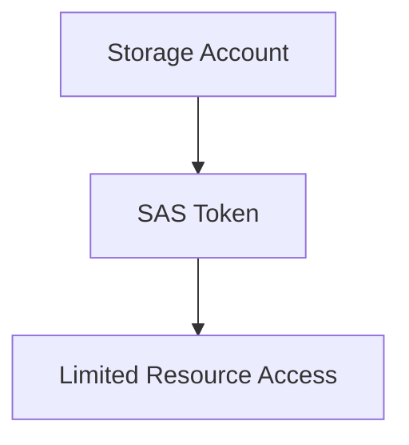

# 🔑 SAS Tokens

> Secure delegated access to Azure Storage resources using Shared Access Signatures (SAS).

---

# 📚 Table of Contents

- [� SAS Tokens](#-sas-tokens)
- [📚 Table of Contents](#-table-of-contents)
- [📌 Overview](#-overview)
- [🏗️ SAS Architecture](#️-sas-architecture)
- [🔑 SAS Types](#-sas-types)
- [⚙️ SAS Configuration](#️-sas-configuration)
  - [Common Tasks](#common-tasks)
- [📊 SAS Permissions](#-sas-permissions)
- [🧪 Azure CLI Examples](#-azure-cli-examples)
  - [Generate Blob SAS](#generate-blob-sas)
- [🧪 PowerShell Examples](#-powershell-examples)
  - [Generate SAS Token](#generate-sas-token)
- [🚨 Common Issues](#-common-issues)
  - [SAS Token Invalid](#sas-token-invalid)
    - [Possible Causes](#possible-causes)
  - [Access Denied](#access-denied)
    - [Common Causes](#common-causes)
- [✅ Best Practices](#-best-practices)
- [📖 References](#-references)

---

# 📌 Overview

Shared Access Signatures (SAS) provide delegated access to Azure Storage resources without exposing account keys.

SAS tokens are commonly used for:

- Temporary access
- Secure file sharing
- Application uploads
- Limited external access

---

# 🏗️ SAS Architecture



---

# 🔑 SAS Types

| SAS Type | Description |
|---|---|
| User Delegation SAS | Secured with Entra ID |
| Service SAS | Access to storage services |
| Account SAS | Broad account-level access |

---

# ⚙️ SAS Configuration

## Common Tasks

- Generate SAS tokens
- Configure expiration times
- Restrict permissions
- Restrict IP ranges
- Configure HTTPS-only access

---

# 📊 SAS Permissions

| Permission | Description |
|---|---|
| Read | View data |
| Write | Upload/modify |
| Delete | Remove objects |
| List | Enumerate resources |

---

# 🧪 Azure CLI Examples

## Generate Blob SAS

```bash
az storage blob generate-sas \
  --container-name backups \
  --name backup.zip \
  --permissions r \
  --expiry 2025-12-31T23:59Z
```

---

# 🧪 PowerShell Examples

## Generate SAS Token

```powershell
New-AzStorageBlobSASToken `
-Container backups `
-Blob backup.zip `
-Permission r
```

---

# 🚨 Common Issues

## SAS Token Invalid

### Possible Causes

- Expired token
- Incorrect permissions
- Time synchronization issue
- Invalid resource scope

---

## Access Denied

### Common Causes

- Firewall restriction
- IP restriction mismatch
- HTTPS enforcement enabled

---

# ✅ Best Practices

- Use short expiration times
- Prefer User Delegation SAS
- Restrict permissions minimally
- Use HTTPS-only access
- Rotate storage keys regularly
- Monitor SAS usage

---

# 📖 References

- [Azure SAS Documentation](https://learn.microsoft.com/en-us/azure/storage/common/storage-sas-overview?utm_source=chatgpt.com)
- [User Delegation SAS Guide](https://learn.microsoft.com/en-us/azure/storage/blobs/storage-blob-user-delegation-sas-create-cli?utm_source=chatgpt.com)
- [Azure Storage Security Recommendations](https://learn.microsoft.com/en-us/azure/storage/common/security-recommendations?utm_source=chatgpt.com)

---