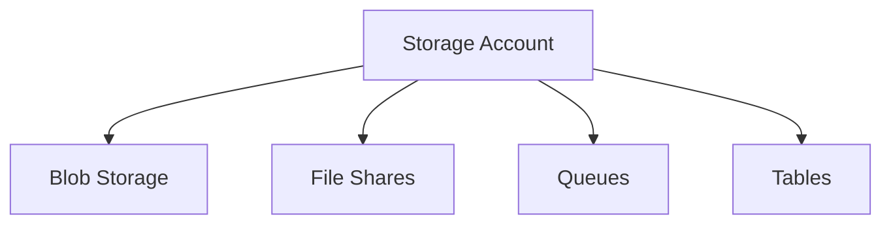

# 💾 Storage Accounts

> Core Azure Storage account administration for enterprise cloud environments.

---

# 📚 Table of Contents

- [� Storage Accounts](#-storage-accounts)
- [📚 Table of Contents](#-table-of-contents)
- [📌 Overview](#-overview)
- [🏗️ Storage Architecture](#️-storage-architecture)
- [🔑 Storage Account Types](#-storage-account-types)
- [⚙️ Configuration](#️-configuration)
  - [Common Administrative Tasks](#common-administrative-tasks)
- [📊 Redundancy Options](#-redundancy-options)
- [🧪 Azure CLI Examples](#-azure-cli-examples)
  - [Create Storage Account](#create-storage-account)
  - [List Storage Accounts](#list-storage-accounts)
- [🧪 PowerShell Examples](#-powershell-examples)
  - [Create Storage Account](#create-storage-account-1)
- [🚨 Common Issues](#-common-issues)
  - [Access Denied](#access-denied)
    - [Possible Causes](#possible-causes)
  - [Replication Delays](#replication-delays)
    - [Common Causes](#common-causes)
- [✅ Best Practices](#-best-practices)
- [📖 References](#-references)

---

# 📌 Overview

Azure Storage Accounts provide scalable and durable cloud storage services.

They support:

- Blob Storage
- File Shares
- Queues
- Tables

Storage Accounts are foundational components for Azure workloads.

---

# 🏗️ Storage Architecture



---

# 🔑 Storage Account Types

| Type | Usage |
|---|---|
| General Purpose v2 | Recommended default |
| Premium Block Blob | High-performance blob workloads |
| Premium File Shares | Enterprise SMB workloads |
| Blob Storage | Legacy blob workloads |

---

# ⚙️ Configuration

## Common Administrative Tasks

- Configure replication
- Enable secure transfer
- Configure networking
- Configure lifecycle policies
- Configure access keys

---

# 📊 Redundancy Options

| Redundancy | Description |
|---|---|
| LRS | Local redundancy |
| ZRS | Zone redundancy |
| GRS | Geo-redundancy |
| GZRS | Geo + zone redundancy |

---

# 🧪 Azure CLI Examples

## Create Storage Account

```bash
az storage account create \
  --name prodstorage01 \
  --resource-group Production-RG \
  --sku Standard_LRS
```

## List Storage Accounts

```bash
az storage account list --output table
```

---

# 🧪 PowerShell Examples

## Create Storage Account

```powershell
New-AzStorageAccount `
-ResourceGroupName "Production-RG" `
-Name "prodstorage01" `
-SkuName Standard_LRS `
-Location eastus
```

---

# 🚨 Common Issues

## Access Denied

### Possible Causes

- Firewall restriction
- Invalid keys
- RBAC issue
- SAS token expiration

---

## Replication Delays

### Common Causes

- Geo-replication latency
- Regional outage
- Service degradation

---

# ✅ Best Practices

- Use GPv2 accounts
- Disable public access when possible
- Enable secure transfer required
- Use private endpoints
- Rotate access keys regularly
- Monitor storage metrics

---

# 📖 References

- [Azure Storage Documentation](https://learn.microsoft.com/en-us/azure/storage/common/storage-account-overview?utm_source=chatgpt.com)
- [Storage Redundancy Options](https://learn.microsoft.com/en-us/azure/storage/common/storage-redundancy?utm_source=chatgpt.com)
- [Azure Storage Security Guide](https://learn.microsoft.com/en-us/azure/storage/common/security-recommendations?utm_source=chatgpt.com)

---