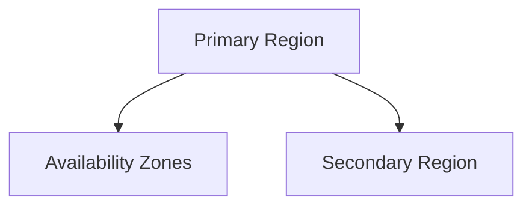

# 🌍 Storage Replication

> Azure Storage redundancy and replication strategies for high availability and disaster recovery.

---

# 📚 Table of Contents

- [🌍 Storage Replication](#-storage-replication)
- [📚 Table of Contents](#-table-of-contents)
- [📌 Overview](#-overview)
- [🏗️ Replication Architecture](#️-replication-architecture)
- [🔑 Replication Types](#-replication-types)
- [⚙️ Replication Configuration](#️-replication-configuration)
  - [Common Tasks](#common-tasks)
- [📊 Replication Comparison](#-replication-comparison)
- [🧪 Azure CLI Examples](#-azure-cli-examples)
  - [Create GRS Storage Account](#create-grs-storage-account)
  - [View Replication Status](#view-replication-status)
- [🧪 PowerShell Examples](#-powershell-examples)
  - [Create Storage Account](#create-storage-account)
- [🚨 Common Issues](#-common-issues)
  - [Replication Delay](#replication-delay)
    - [Possible Causes](#possible-causes)
  - [Failover Not Available](#failover-not-available)
    - [Common Causes](#common-causes)
- [✅ Best Practices](#-best-practices)
- [📖 References](#-references)

---

# 📌 Overview

Azure Storage replication ensures data durability and availability during failures and outages.

Replication strategies help organizations:

- Protect against hardware failures
- Survive datacenter outages
- Improve disaster recovery
- Meet compliance requirements

---

# 🏗️ Replication Architecture



---

# 🔑 Replication Types

| Replication | Description |
|---|---|
| LRS | Local redundancy |
| ZRS | Zone redundancy |
| GRS | Geo-redundancy |
| RA-GRS | Read-access geo redundancy |
| GZRS | Geo-zone redundancy |
| RA-GZRS | Read-access geo-zone redundancy |

---

# ⚙️ Replication Configuration

## Common Tasks

- Configure redundancy
- Change replication type
- Validate secondary region
- Configure failover strategy

---

# 📊 Replication Comparison

| Type | Zone Protection | Regional Protection |
|---|---|---|
| LRS | ❌ | ❌ |
| ZRS | ✅ | ❌ |
| GRS | ❌ | ✅ |
| GZRS | ✅ | ✅ |

---

# 🧪 Azure CLI Examples

## Create GRS Storage Account

```bash
az storage account create \
  --name prodstorage01 \
  --sku Standard_GRS \
  --resource-group Production-RG
```

## View Replication Status

```bash
az storage account show \
  --name prodstorage01
```

---

# 🧪 PowerShell Examples

## Create Storage Account

```powershell
New-AzStorageAccount `
-Name "prodstorage01" `
-ResourceGroupName "Production-RG" `
-SkuName Standard_GRS
```

---

# 🚨 Common Issues

## Replication Delay

### Possible Causes

- High write volume
- Regional latency
- Azure service degradation

---

## Failover Not Available

### Common Causes

- Unsupported redundancy type
- Secondary region unavailable
- Replication not synchronized

---

# ✅ Best Practices

- Use GZRS for critical workloads
- Match redundancy to business requirements
- Test disaster recovery procedures
- Monitor replication health
- Avoid overprovisioning expensive redundancy

---

# 📖 References

- [Azure Storage Redundancy Documentation](https://learn.microsoft.com/en-us/azure/storage/common/storage-redundancy?utm_source=chatgpt.com)
- [Azure Storage Disaster Recovery Guide](https://learn.microsoft.com/en-us/azure/storage/common/storage-disaster-recovery-guidance?utm_source=chatgpt.com)

---