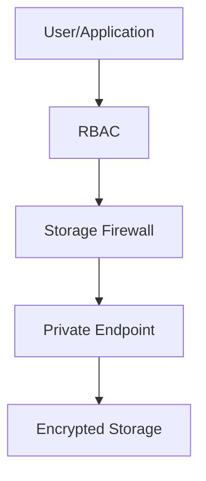

# 🔐 Storage Security

> Secure Azure Storage accounts and data using enterprise-grade security controls.

---

# 📚 Table of Contents

- [� Storage Security](#-storage-security)
- [📚 Table of Contents](#-table-of-contents)
- [📌 Overview](#-overview)
- [🏗️ Storage Security Architecture](#️-storage-security-architecture)
- [🔑 Core Security Controls](#-core-security-controls)
- [⚙️ Network Security](#️-network-security)
  - [Recommended Controls](#recommended-controls)
- [⚙️ Identity \& Access Security](#️-identity--access-security)
  - [Authentication Methods](#authentication-methods)
- [📊 Encryption Options](#-encryption-options)
- [🧪 Azure CLI Examples](#-azure-cli-examples)
  - [Disable Public Blob Access](#disable-public-blob-access)
  - [Enable Secure Transfer](#enable-secure-transfer)
- [🚨 Common Issues](#-common-issues)
  - [Access Blocked](#access-blocked)
    - [Possible Causes](#possible-causes)
  - [Public Access Exposure](#public-access-exposure)
    - [Common Causes](#common-causes)
- [✅ Best Practices](#-best-practices)
- [📖 References](#-references)

---

# 📌 Overview

Azure Storage Security protects storage resources against unauthorized access, data leakage, and network exposure.

Key security areas:

- Identity protection
- Network isolation
- Encryption
- Access auditing
- Threat protection

---

# 🏗️ Storage Security Architecture



---

# 🔑 Core Security Controls

| Control | Purpose |
|---|---|
| RBAC | Identity-based access |
| SAS Tokens | Delegated access |
| Private Endpoints | Private connectivity |
| Firewall Rules | Network restrictions |
| Encryption | Data protection |

---

# ⚙️ Network Security

## Recommended Controls

- Disable public access
- Restrict IP ranges
- Use Private Endpoints
- Use VNets
- Enable secure transfer required

---

# ⚙️ Identity & Access Security

## Authentication Methods

| Method | Recommendation |
|---|---|
| Entra ID RBAC | Recommended |
| SAS Tokens | Temporary access |
| Access Keys | Avoid when possible |

---

# 📊 Encryption Options

| Encryption | Description |
|---|---|
| Microsoft-Managed Keys | Default encryption |
| Customer-Managed Keys | Enterprise control |
| Infrastructure Encryption | Additional encryption layer |

---

# 🧪 Azure CLI Examples

## Disable Public Blob Access

```bash
az storage account update \
  --name prodstorage01 \
  --allow-blob-public-access false
```

## Enable Secure Transfer

```bash
az storage account update \
  --https-only true
```

---

# 🚨 Common Issues

## Access Blocked

### Possible Causes

- Firewall restriction
- Private endpoint DNS issue
- RBAC permission missing
- SAS token expired

---

## Public Access Exposure

### Common Causes

- Misconfigured container access
- Public blob enabled
- Excessive SAS permissions

---

# ✅ Best Practices

- Use Entra ID authentication
- Disable public access
- Use private endpoints
- Rotate access keys
- Enable Defender for Storage
- Monitor access logs
- Apply least privilege

---

# 📖 References

- [Azure Storage Security Guide](https://learn.microsoft.com/en-us/azure/storage/common/security-recommendations?utm_source=chatgpt.com)
- [Azure Private Endpoints Documentation](https://learn.microsoft.com/en-us/azure/private-link/private-endpoint-overview?utm_source=chatgpt.com)
- [Microsoft Defender for Storage Documentation](https://learn.microsoft.com/en-us/azure/defender-for-cloud/defender-for-storage-introduction?utm_source=chatgpt.com)

---