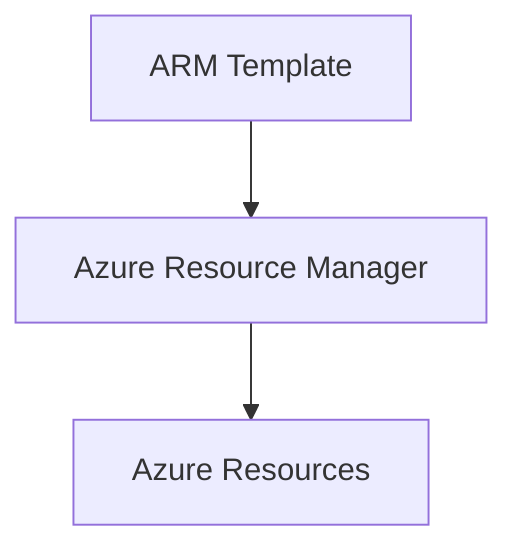

# 🏗️ ARM Templates

> Infrastructure as Code (IaC) deployments using Azure Resource Manager templates.

---

# 📚 Table of Contents

- [🏗️ ARM Templates](#️-arm-templates)
- [📚 Table of Contents](#-table-of-contents)
- [📌 Overview](#-overview)
- [🏗️ ARM Template Architecture](#️-arm-template-architecture)
- [🔑 Core Concepts](#-core-concepts)
- [⚙️ ARM Template Structure](#️-arm-template-structure)
  - [Core Sections](#core-sections)
- [📊 Deployment Modes](#-deployment-modes)
- [🧪 ARM Template Example](#-arm-template-example)
  - [Deploy Storage Account](#deploy-storage-account)
- [🧪 Azure CLI Examples](#-azure-cli-examples)
  - [Deploy ARM Template](#deploy-arm-template)
- [🚨 Common Issues](#-common-issues)
  - [Deployment Failed](#deployment-failed)
    - [Possible Causes](#possible-causes)
  - [Resource Already Exists](#resource-already-exists)
    - [Common Causes](#common-causes)
- [✅ Best Practices](#-best-practices)
- [📖 References](#-references)

---

# 📌 Overview

Azure Resource Manager (ARM) templates allow administrators to deploy Azure infrastructure declaratively using JSON.

ARM templates help organizations:

- Standardize deployments
- Automate infrastructure
- Reduce configuration drift
- Support CI/CD pipelines

---

# 🏗️ ARM Template Architecture



---

# 🔑 Core Concepts

| Component | Description |
|---|---|
| Template | Infrastructure definition |
| Parameters | Dynamic deployment values |
| Variables | Reusable template values |
| Resources | Azure objects |
| Outputs | Deployment results |

---

# ⚙️ ARM Template Structure

## Core Sections

```json
{
  "$schema": "",
  "parameters": {},
  "variables": {},
  "resources": [],
  "outputs": {}
}
```

---

# 📊 Deployment Modes

| Mode | Behavior |
|---|---|
| Incremental | Adds/updates resources |
| Complete | Removes unmanaged resources |

---

# 🧪 ARM Template Example

## Deploy Storage Account

```json
{
  "$schema": "https://schema.management.azure.com/schemas/2019-04-01/deploymentTemplate.json#",
  "contentVersion": "1.0.0.0",
  "resources": [
    {
      "type": "Microsoft.Storage/storageAccounts",
      "apiVersion": "2023-01-01",
      "name": "prodstorage01",
      "location": "eastus",
      "sku": {
        "name": "Standard_LRS"
      },
      "kind": "StorageV2"
    }
  ]
}
```

---

# 🧪 Azure CLI Examples

## Deploy ARM Template

```bash
az deployment group create \
  --resource-group Production-RG \
  --template-file storage.json
```

---

# 🚨 Common Issues

## Deployment Failed

### Possible Causes

- Invalid JSON syntax
- Missing parameters
- Unsupported API version
- RBAC permissions issue

---

## Resource Already Exists

### Common Causes

- Naming conflict
- Existing deployment
- Incorrect deployment mode

---

# ✅ Best Practices

- Use parameter files
- Use incremental deployments
- Store templates in source control
- Validate templates before deployment
- Use reusable modules

---

# 📖 References

- [ARM Templates Documentation](https://learn.microsoft.com/en-us/azure/azure-resource-manager/templates/overview?utm_source=chatgpt.com)
- [ARM Template Best Practices](https://learn.microsoft.com/en-us/azure/azure-resource-manager/templates/best-practices?utm_source=chatgpt.com)
- [Quickstart ARM Templates](https://learn.microsoft.com/en-us/azure/templates/?utm_source=chatgpt.com)

---