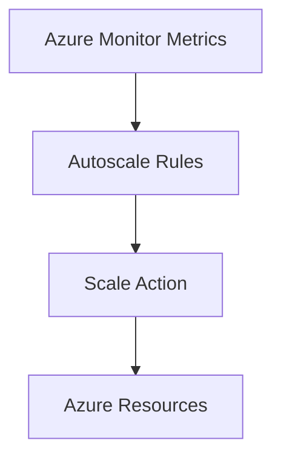

# 📊 Autoscaling

> Automatically scale Azure resources based on workload demand.

---

# 📚 Table of Contents

- [� Autoscaling](#-autoscaling)
- [📚 Table of Contents](#-table-of-contents)
- [📌 Overview](#-overview)
- [🏗️ Autoscaling Architecture](#️-autoscaling-architecture)
- [🔑 Core Concepts](#-core-concepts)
- [⚙️ Autoscaling Rules](#️-autoscaling-rules)
  - [Common Metrics](#common-metrics)
- [📊 Scaling Scenarios](#-scaling-scenarios)
- [🧪 Azure CLI Examples](#-azure-cli-examples)
  - [Configure Autoscaling](#configure-autoscaling)
  - [Add Autoscale Rule](#add-autoscale-rule)
- [🚨 Common Issues](#-common-issues)
  - [Autoscale Not Triggering](#autoscale-not-triggering)
    - [Possible Causes](#possible-causes)
  - [Excessive Scaling](#excessive-scaling)
    - [Common Causes](#common-causes)
- [✅ Best Practices](#-best-practices)
- [📖 References](#-references)

---

# 📌 Overview

Azure Autoscaling dynamically adjusts resource capacity based on workload demand.

Autoscaling improves:

- Performance
- Availability
- Cost optimization
- Operational efficiency

---

# 🏗️ Autoscaling Architecture



---

# 🔑 Core Concepts

| Component | Description |
|---|---|
| Scale Out | Add instances |
| Scale In | Remove instances |
| Metric Trigger | CPU, memory, queue |
| Profile | Scaling schedule |

---

# ⚙️ Autoscaling Rules

## Common Metrics

- CPU Percentage
- Memory Usage
- Queue Length
- HTTP Request Count

---

# 📊 Scaling Scenarios

| Scenario | Action |
|---|---|
| High CPU | Add instances |
| Low Utilization | Remove instances |
| Business Hours | Scheduled scale out |

---

# 🧪 Azure CLI Examples

## Configure Autoscaling

```bash
az monitor autoscale create \
  --resource-group Production-RG \
  --resource Web-VMSS
```

## Add Autoscale Rule

```bash
az monitor autoscale rule create \
  --autoscale-name Web-VMSS
```

---

# 🚨 Common Issues

## Autoscale Not Triggering

### Possible Causes

- Missing metrics
- Incorrect thresholds
- Monitoring disabled
- Rule conflicts

---

## Excessive Scaling

### Common Causes

- Aggressive thresholds
- Rapid workload fluctuations
- Incorrect cooldown periods

---

# ✅ Best Practices

- Use realistic thresholds
- Configure cooldown periods
- Monitor scaling events
- Combine scheduled and metric scaling
- Test autoscale behavior regularly

---

# 📖 References

- [Azure Autoscale Documentation](https://learn.microsoft.com/en-us/azure/azure-monitor/autoscale/autoscale-overview?utm_source=chatgpt.com)
- [Azure Monitor Documentation](https://learn.microsoft.com/en-us/azure/azure-monitor/?utm_source=chatgpt.com)
- [VM Scale Sets Autoscaling](https://learn.microsoft.com/en-us/azure/virtual-machine-scale-sets/virtual-machine-scale-sets-autoscale-overview?utm_source=chatgpt.com)

---