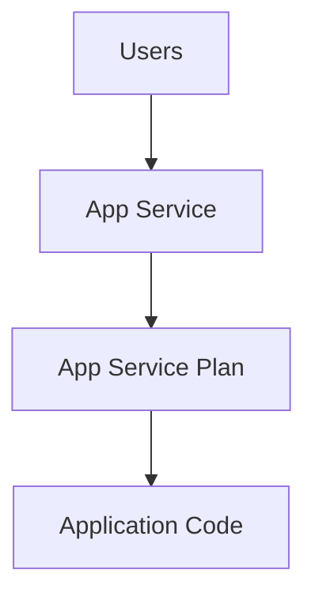

# 🌐 Azure App Services

> Fully managed platform for hosting web applications and APIs in Azure.

---

# 📚 Table of Contents

- [🌐 Azure App Services](#-azure-app-services)
- [📚 Table of Contents](#-table-of-contents)
- [📌 Overview](#-overview)
- [🏗️ App Service Architecture](#️-app-service-architecture)
- [🔑 Core Components](#-core-components)
- [⚙️ App Service Administration](#️-app-service-administration)
  - [Common Administrative Tasks](#common-administrative-tasks)
- [📊 Hosting Plans](#-hosting-plans)
- [🧪 Azure CLI Examples](#-azure-cli-examples)
  - [Create Web App](#create-web-app)
  - [Start Web App](#start-web-app)
- [🧪 PowerShell Examples](#-powershell-examples)
  - [Create App Service Plan](#create-app-service-plan)
- [🚨 Common Issues](#-common-issues)
  - [Application Not Starting](#application-not-starting)
    - [Possible Causes](#possible-causes)
  - [High Response Times](#high-response-times)
    - [Common Causes](#common-causes)
- [✅ Best Practices](#-best-practices)
- [📖 References](#-references)

---

# 📌 Overview

Azure App Service is a Platform-as-a-Service (PaaS) offering for hosting:

- Web applications
- REST APIs
- Backend services
- Mobile applications

It provides automatic scaling, patching, and high availability.

---

# 🏗️ App Service Architecture



---

# 🔑 Core Components

| Component | Description |
|---|---|
| App Service Plan | Compute resources |
| Web App | Hosted application |
| Deployment Slot | Staging environments |
| Scaling | Automatic or manual scaling |

---

# ⚙️ App Service Administration

## Common Administrative Tasks

- Deploy applications
- Configure scaling
- Configure custom domains
- Enable HTTPS
- Configure deployment slots

---

# 📊 Hosting Plans

| Tier | Usage |
|---|---|
| Free | Testing |
| Basic | Small workloads |
| Standard | Production workloads |
| Premium | Enterprise workloads |

---

# 🧪 Azure CLI Examples

## Create Web App

```bash
az webapp create \
  --resource-group Production-RG \
  --plan Prod-AppPlan \
  --name prod-webapp01
```

## Start Web App

```bash
az webapp start \
  --name prod-webapp01 \
  --resource-group Production-RG
```

---

# 🧪 PowerShell Examples

## Create App Service Plan

```powershell
New-AzAppServicePlan `
-Name "Prod-AppPlan" `
-ResourceGroupName "Production-RG"
```

---

# 🚨 Common Issues

## Application Not Starting

### Possible Causes

- Runtime mismatch
- Deployment failure
- Startup command issue
- Application crash

---

## High Response Times

### Common Causes

- Insufficient scaling
- Memory exhaustion
- Database latency
- Traffic spikes

---

# ✅ Best Practices

- Use deployment slots
- Enable autoscaling
- Enable HTTPS only
- Monitor application metrics
- Use managed identities
- Configure backups

---

# 📖 References

- [Azure App Service Documentation](https://learn.microsoft.com/en-us/azure/app-service/overview?utm_source=chatgpt.com)
- [App Service Scaling Documentation](https://learn.microsoft.com/en-us/azure/app-service/manage-scale-up?utm_source=chatgpt.com)
- [Deployment Slots Documentation](https://learn.microsoft.com/en-us/azure/app-service/deploy-staging-slots?utm_source=chatgpt.com)

---