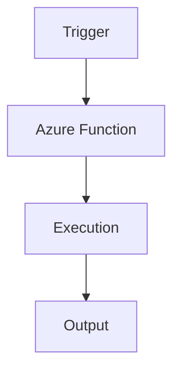

# ⚡ Azure Functions

> Serverless compute platform for event-driven applications in Azure.

---

# 📚 Table of Contents

- [⚡ Azure Functions](#-azure-functions)
- [📚 Table of Contents](#-table-of-contents)
- [📌 Overview](#-overview)
- [🏗️ Functions Architecture](#️-functions-architecture)
- [🔑 Core Concepts](#-core-concepts)
- [⚙️ Function Administration](#️-function-administration)
  - [Common Tasks](#common-tasks)
- [📊 Hosting Plans](#-hosting-plans)
- [🧪 Azure CLI Examples](#-azure-cli-examples)
  - [Create Function App](#create-function-app)
  - [List Function Apps](#list-function-apps)
- [🚨 Common Issues](#-common-issues)
  - [Function Timeout](#function-timeout)
    - [Possible Causes](#possible-causes)
  - [Trigger Not Firing](#trigger-not-firing)
    - [Common Causes](#common-causes)
- [✅ Best Practices](#-best-practices)
- [📖 References](#-references)

---

# 📌 Overview

Azure Functions provides serverless compute for running code without managing infrastructure.

Common use cases:

- Event processing
- Automation
- Scheduled tasks
- API integrations
- Background jobs

---

# 🏗️ Functions Architecture



---

# 🔑 Core Concepts

| Component | Description |
|---|---|
| Trigger | Event source |
| Binding | Input/output connection |
| Function App | Hosting container |
| Consumption Plan | Serverless execution |

---

# ⚙️ Function Administration

## Common Tasks

- Deploy functions
- Configure triggers
- Configure scaling
- Monitor executions
- Configure application settings

---

# 📊 Hosting Plans

| Plan | Usage |
|---|---|
| Consumption | Event-driven workloads |
| Premium | Enterprise workloads |
| Dedicated | App Service integration |

---

# 🧪 Azure CLI Examples

## Create Function App

```bash
az functionapp create \
  --resource-group Production-RG \
  --name prod-func01
```

## List Function Apps

```bash
az functionapp list --output table
```

---

# 🚨 Common Issues

## Function Timeout

### Possible Causes

- Long-running execution
- Consumption plan limits
- Dependency latency

---

## Trigger Not Firing

### Common Causes

- Misconfigured trigger
- Storage issue
- Permission failure

---

# ✅ Best Practices

- Use managed identities
- Monitor execution failures
- Store secrets in Key Vault
- Use retry policies
- Separate environments

---

# 📖 References

- [Azure Functions Documentation](https://learn.microsoft.com/en-us/azure/azure-functions/functions-overview?utm_source=chatgpt.com)
- [Azure Functions Hosting Plans](https://learn.microsoft.com/en-us/azure/azure-functions/functions-scale?utm_source=chatgpt.com)
- [Azure Functions Best Practices](https://learn.microsoft.com/en-us/azure/azure-functions/functions-best-practices?utm_source=chatgpt.com)

---