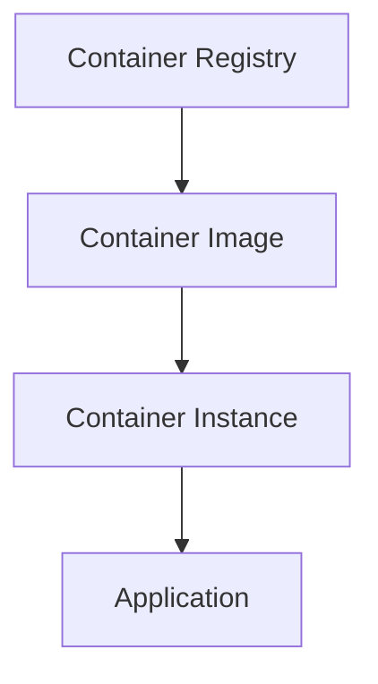

# 📦 Containers

> Containerized workloads and container services in Azure.

---

# 📚 Table of Contents

- [� Containers](#-containers)
- [📚 Table of Contents](#-table-of-contents)
- [📌 Overview](#-overview)
- [🏗️ Container Architecture](#️-container-architecture)
- [🔑 Core Concepts](#-core-concepts)
- [⚙️ Azure Container Services](#️-azure-container-services)
- [📊 Container Comparison](#-container-comparison)
- [🧪 Azure CLI Examples](#-azure-cli-examples)
  - [Create Container Instance](#create-container-instance)
  - [Create Container Registry](#create-container-registry)
- [🚨 Common Issues](#-common-issues)
  - [Container Not Starting](#container-not-starting)
    - [Possible Causes](#possible-causes)
  - [Image Pull Failure](#image-pull-failure)
    - [Common Causes](#common-causes)
- [✅ Best Practices](#-best-practices)
- [📖 References](#-references)

---

# 📌 Overview

Azure supports multiple container platforms for deploying modern applications.

Container technologies help organizations:

- Improve portability
- Simplify deployments
- Scale applications efficiently
- Support microservices architectures

---

# 🏗️ Container Architecture



---

# 🔑 Core Concepts

| Component | Description |
|---|---|
| Container Image | Packaged application |
| Registry | Image storage |
| Container Runtime | Executes containers |
| Orchestration | Container management |

---

# ⚙️ Azure Container Services

| Service | Usage |
|---|---|
| Azure Container Instances (ACI) | Simple containers |
| Azure Kubernetes Service (AKS) | Container orchestration |
| Azure Container Registry (ACR) | Private registry |

---

# 📊 Container Comparison

| Service | Complexity | Use Case |
|---|---|---|
| ACI | Low | Simple workloads |
| AKS | High | Enterprise orchestration |
| App Service Containers | Medium | Web apps |

---

# 🧪 Azure CLI Examples

## Create Container Instance

```bash
az container create \
  --resource-group Production-RG \
  --name nginx-container \
  --image nginx
```

## Create Container Registry

```bash
az acr create \
  --resource-group Production-RG \
  --name prodregistry01 \
  --sku Basic
```

---

# 🚨 Common Issues

## Container Not Starting

### Possible Causes

- Invalid image
- Resource exhaustion
- Port conflict
- Startup failure

---

## Image Pull Failure

### Common Causes

- Registry authentication issue
- Missing image tag
- Network restriction

---

# ✅ Best Practices

- Use private registries
- Scan images for vulnerabilities
- Use managed identities
- Monitor container logs
- Use least privilege networking

---

# 📖 References

- [Azure Containers Documentation](https://learn.microsoft.com/en-us/azure/containers/?utm_source=chatgpt.com)
- [Azure Kubernetes Service Documentation](https://learn.microsoft.com/en-us/azure/aks/?utm_source=chatgpt.com)
- [Azure Container Registry Documentation](https://learn.microsoft.com/en-us/azure/container-registry/?utm_source=chatgpt.com)

---