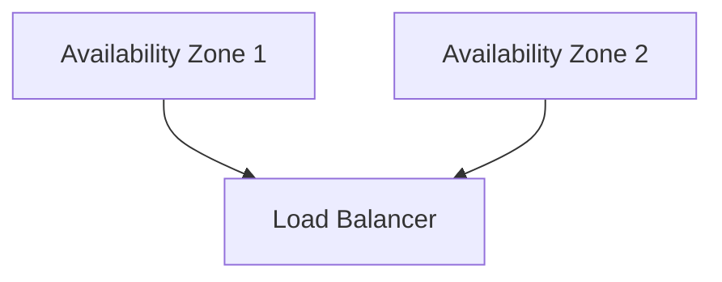

# 🌐 VM Availability

> High availability and resiliency strategies for Azure Virtual Machines.

---

# 📚 Table of Contents

- [🌐 VM Availability](#-vm-availability)
- [📚 Table of Contents](#-table-of-contents)
- [📌 Overview](#-overview)
- [🏗️ Availability Architecture](#️-availability-architecture)
- [🔑 Core Concepts](#-core-concepts)
- [⚙️ Availability Options](#️-availability-options)
  - [Availability Set](#availability-set)
  - [Availability Zones](#availability-zones)
- [📊 Availability Comparison](#-availability-comparison)
- [🧪 Azure CLI Examples](#-azure-cli-examples)
  - [Create VM in Availability Zone](#create-vm-in-availability-zone)
- [🧪 PowerShell Examples](#-powershell-examples)
  - [Create Availability Set](#create-availability-set)
- [🚨 Common Issues](#-common-issues)
  - [VM Not Highly Available](#vm-not-highly-available)
    - [Possible Causes](#possible-causes)
  - [Zone Capacity Failure](#zone-capacity-failure)
    - [Common Causes](#common-causes)
- [✅ Best Practices](#-best-practices)
- [📖 References](#-references)

---

# 📌 Overview

Azure provides multiple availability options to minimize downtime and improve resiliency.

Availability strategies help protect workloads from:

- Hardware failures
- Datacenter outages
- Planned maintenance
- Regional failures

---

# 🏗️ Availability Architecture



---

# 🔑 Core Concepts

| Component | Description |
|---|---|
| Availability Set | Fault/update domain separation |
| Availability Zone | Physically separate datacenter |
| Scale Set | Automated scaling |
| Load Balancer | Traffic distribution |

---

# ⚙️ Availability Options

## Availability Set

Protects against:
- Host failures
- Planned maintenance

---

## Availability Zones

Protects against:
- Datacenter failures
- Zone outages

---

# 📊 Availability Comparison

| Feature | Availability Set | Availability Zone |
|---|---|---|
| Fault Isolation | ✅ | ✅ |
| Datacenter Isolation | ❌ | ✅ |
| SLA Improvement | ✅ | ✅ |

---

# 🧪 Azure CLI Examples

## Create VM in Availability Zone

```bash
az vm create \
  --resource-group Production-RG \
  --name WebVM01 \
  --zone 1
```

---

# 🧪 PowerShell Examples

## Create Availability Set

```powershell
New-AzAvailabilitySet `
-ResourceGroupName "Production-RG" `
-Name "Prod-AVSet"
```

---

# 🚨 Common Issues

## VM Not Highly Available

### Possible Causes

- Single-instance deployment
- Missing zones
- No load balancer

---

## Zone Capacity Failure

### Common Causes

- Regional capacity exhaustion
- Unsupported VM size

---

# ✅ Best Practices

- Use Availability Zones when possible
- Use Load Balancers
- Distribute workloads across zones
- Test failover scenarios
- Use managed disks

---

# 📖 References

- [Azure Availability Options Documentation](https://learn.microsoft.com/en-us/azure/virtual-machines/availability?utm_source=chatgpt.com)
- [Availability Zones Documentation](https://learn.microsoft.com/en-us/azure/reliability/availability-zones-overview?utm_source=chatgpt.com)
- [Azure SLA Documentation](https://learn.microsoft.com/en-us/azure/virtual-machines/virtual-machines-common-outages?utm_source=chatgpt.com)

---