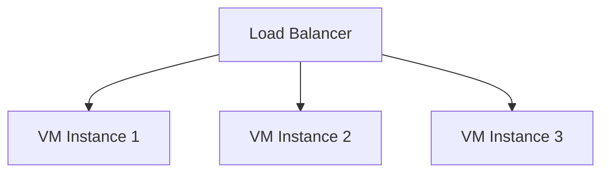

# 📈 VM Scale Sets

> Automated scaling and management of Azure Virtual Machines.

---

# 📚 Table of Contents

- [� VM Scale Sets](#-vm-scale-sets)
- [📚 Table of Contents](#-table-of-contents)
- [📌 Overview](#-overview)
- [🏗️ Scale Set Architecture](#️-scale-set-architecture)
- [🔑 Core Concepts](#-core-concepts)
- [⚙️ Autoscaling](#️-autoscaling)
  - [Autoscaling Triggers](#autoscaling-triggers)
- [📊 Scaling Scenarios](#-scaling-scenarios)
- [🧪 Azure CLI Examples](#-azure-cli-examples)
  - [Create Scale Set](#create-scale-set)
  - [Scale Out](#scale-out)
- [🧪 PowerShell Examples](#-powershell-examples)
  - [Create Scale Set](#create-scale-set-1)
- [🚨 Common Issues](#-common-issues)
  - [Autoscaling Not Triggering](#autoscaling-not-triggering)
    - [Possible Causes](#possible-causes)
  - [Instance Provisioning Failure](#instance-provisioning-failure)
    - [Common Causes](#common-causes)
- [✅ Best Practices](#-best-practices)
- [📖 References](#-references)

---

# 📌 Overview

Virtual Machine Scale Sets (VMSS) allow administrators to deploy and manage identical VM instances at scale.

Common use cases:

- Web applications
- Stateless workloads
- Autoscaling applications
- High availability deployments

---

# 🏗️ Scale Set Architecture



---

# 🔑 Core Concepts

| Component | Description |
|---|---|
| Scale Set | Group of identical VMs |
| Autoscaling | Dynamic instance adjustment |
| Instance Count | Number of active VMs |
| Upgrade Policy | VM update behavior |

---

# ⚙️ Autoscaling

## Autoscaling Triggers

- CPU utilization
- Memory usage
- Queue length
- Scheduled scaling

---

# 📊 Scaling Scenarios

| Scenario | Scaling Action |
|---|---|
| High CPU | Scale out |
| Low Traffic | Scale in |
| Peak Hours | Scheduled scaling |

---

# 🧪 Azure CLI Examples

## Create Scale Set

```bash
az vmss create \
  --resource-group Production-RG \
  --name Web-VMSS \
  --instance-count 2
```

## Scale Out

```bash
az vmss scale \
  --name Web-VMSS \
  --new-capacity 5 \
  --resource-group Production-RG
```

---

# 🧪 PowerShell Examples

## Create Scale Set

```powershell
New-AzVmss `
-ResourceGroupName "Production-RG" `
-VMScaleSetName "Web-VMSS"
```

---

# 🚨 Common Issues

## Autoscaling Not Triggering

### Possible Causes

- Incorrect metrics
- Misconfigured thresholds
- Monitoring disabled

---

## Instance Provisioning Failure

### Common Causes

- VM quota exceeded
- Invalid image
- Network issue

---

# ✅ Best Practices

- Use autoscaling rules
- Monitor scaling events
- Use Availability Zones
- Configure health probes
- Avoid over-aggressive scaling

---

# 📖 References

- [Azure VM Scale Sets Documentation](https://learn.microsoft.com/en-us/azure/virtual-machine-scale-sets/overview?utm_source=chatgpt.com)
- [Azure Autoscale Documentation](https://learn.microsoft.com/en-us/azure/azure-monitor/autoscale/autoscale-overview?utm_source=chatgpt.com)
- [VMSS Best Practices](https://learn.microsoft.com/en-us/azure/virtual-machine-scale-sets/virtual-machine-scale-sets-best-practices?utm_source=chatgpt.com)

---