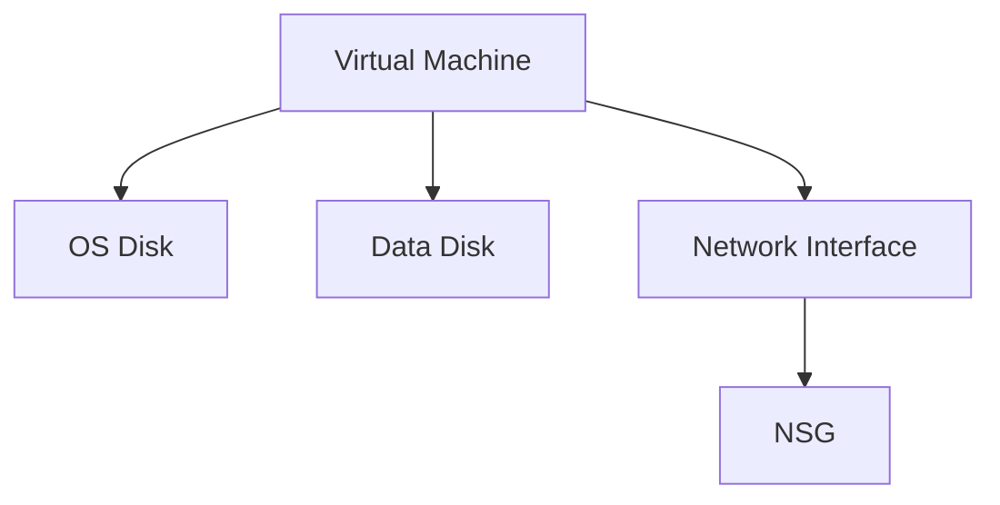

# 🖥️ Virtual Machines

> Azure Virtual Machine administration for enterprise cloud environments.

---

# 📚 Table of Contents

- [�️ Virtual Machines](#️-virtual-machines)
- [📚 Table of Contents](#-table-of-contents)
- [📌 Overview](#-overview)
- [🏗️ VM Architecture](#️-vm-architecture)
- [🔑 Core Components](#-core-components)
- [⚙️ VM Administration](#️-vm-administration)
  - [Common Administrative Tasks](#common-administrative-tasks)
- [📊 VM Sizes](#-vm-sizes)
- [🧪 Azure CLI Examples](#-azure-cli-examples)
  - [Create VM](#create-vm)
  - [Start VM](#start-vm)
- [🧪 PowerShell Examples](#-powershell-examples)
  - [Create VM](#create-vm-1)
- [🚨 Common Issues](#-common-issues)
  - [VM Connection Failure](#vm-connection-failure)
    - [Possible Causes](#possible-causes)
  - [High CPU Usage](#high-cpu-usage)
    - [Common Causes](#common-causes)
- [✅ Best Practices](#-best-practices)
- [📖 References](#-references)

---

# 📌 Overview

Azure Virtual Machines provide Infrastructure-as-a-Service (IaaS) compute resources.

VMs support:

- Windows workloads
- Linux workloads
- Enterprise applications
- Hybrid infrastructure
- Development environments

---

# 🏗️ VM Architecture



---

# 🔑 Core Components

| Component | Description |
|---|---|
| VM Size | CPU/RAM allocation |
| OS Disk | Operating system storage |
| Data Disk | Application data storage |
| NIC | Network connectivity |
| NSG | Traffic filtering |

---

# ⚙️ VM Administration

## Common Administrative Tasks

- Create VMs
- Resize VMs
- Attach disks
- Configure networking
- Enable backups
- Configure availability

---

# 📊 VM Sizes

| Series | Usage |
|---|---|
| B-Series | Burstable workloads |
| D-Series | General purpose |
| E-Series | Memory optimized |
| F-Series | Compute optimized |

---

# 🧪 Azure CLI Examples

## Create VM

```bash
az vm create \
  --resource-group Production-RG \
  --name WebVM01 \
  --image Ubuntu2204
```

## Start VM

```bash
az vm start \
  --resource-group Production-RG \
  --name WebVM01
```

---

# 🧪 PowerShell Examples

## Create VM

```powershell
New-AzVM `
-ResourceGroupName "Production-RG" `
-Name "WebVM01"
```

---

# 🚨 Common Issues

## VM Connection Failure

### Possible Causes

- NSG blocking traffic
- VM stopped
- Incorrect credentials
- Firewall restriction

---

## High CPU Usage

### Common Causes

- Resource exhaustion
- Application issue
- Incorrect VM sizing

---

# ✅ Best Practices

- Use Managed Disks
- Enable backups
- Use NSGs
- Enable monitoring
- Use availability zones
- Apply least privilege access

---

# 📖 References

- [Azure Virtual Machines Documentation](https://learn.microsoft.com/en-us/azure/virtual-machines/overview?utm_source=chatgpt.com)
- [Azure VM Sizes Documentation](https://learn.microsoft.com/en-us/azure/virtual-machines/sizes/overview?utm_source=chatgpt.com)
- [Azure VM Best Practices](https://learn.microsoft.com/en-us/azure/virtual-machines/best-practices?utm_source=chatgpt.com)

---