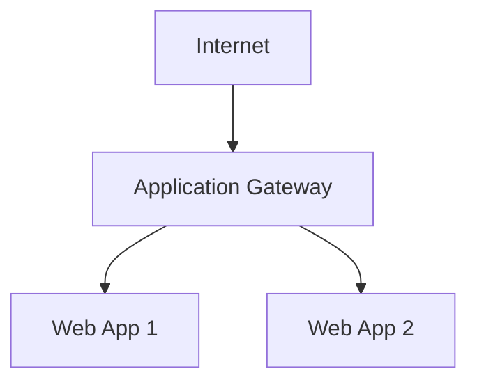

# 🚪 Application Gateway

> Layer 7 web traffic load balancing and web application protection in Azure.

---

# 📚 Table of Contents

- [� Application Gateway](#-application-gateway)
- [📚 Table of Contents](#-table-of-contents)
- [📌 Overview](#-overview)
- [🏗️ Application Gateway Architecture](#️-application-gateway-architecture)
- [🔑 Core Concepts](#-core-concepts)
- [⚙️ Application Gateway Features](#️-application-gateway-features)
  - [Key Features](#key-features)
- [📊 WAF Capabilities](#-waf-capabilities)
- [🧪 Azure CLI Examples](#-azure-cli-examples)
  - [Create Application Gateway](#create-application-gateway)
  - [Enable WAF](#enable-waf)
- [🧪 PowerShell Examples](#-powershell-examples)
  - [Create Application Gateway](#create-application-gateway-1)
- [🚨 Common Issues](#-common-issues)
  - [Backend Health Unhealthy](#backend-health-unhealthy)
    - [Possible Causes](#possible-causes)
  - [SSL Errors](#ssl-errors)
    - [Common Causes](#common-causes)
- [✅ Best Practices](#-best-practices)
- [📖 References](#-references)

---

# 📌 Overview

Azure Application Gateway is a Layer 7 load balancer for web applications.

It supports:

- HTTP/HTTPS routing
- SSL termination
- Web Application Firewall (WAF)
- URL-based routing
- Session affinity

---

# 🏗️ Application Gateway Architecture



---

# 🔑 Core Concepts

| Component | Description |
|---|---|
| Listener | Incoming request handler |
| Backend Pool | Target resources |
| Routing Rule | Traffic routing |
| WAF | Web application protection |

---

# ⚙️ Application Gateway Features

## Key Features

- SSL offloading
- Path-based routing
- Multi-site hosting
- End-to-end TLS
- Web Application Firewall

---

# 📊 WAF Capabilities

| Protection | Description |
|---|---|
| SQL Injection | Blocks malicious SQL |
| XSS Protection | Blocks script injection |
| OWASP Rules | Standard protection |

---

# 🧪 Azure CLI Examples

## Create Application Gateway

```bash
az network application-gateway create \
  --resource-group Production-RG \
  --name Prod-AppGW
```

## Enable WAF

```bash
az network application-gateway waf-policy create \
  --resource-group Production-RG \
  --name Prod-WAF
```

---

# 🧪 PowerShell Examples

## Create Application Gateway

```powershell
New-AzApplicationGateway `
-Name "Prod-AppGW" `
-ResourceGroupName "Production-RG"
```

---

# 🚨 Common Issues

## Backend Health Unhealthy

### Possible Causes

- NSG restriction
- DNS resolution failure
- Backend application failure

---

## SSL Errors

### Common Causes

- Expired certificate
- Incorrect TLS configuration
- Certificate mismatch

---

# ✅ Best Practices

- Enable WAF for internet-facing apps
- Use end-to-end TLS
- Monitor backend health
- Use autoscaling
- Keep certificates updated

---

# 📖 References

- [Azure Application Gateway Documentation](https://learn.microsoft.com/en-us/azure/application-gateway/overview?utm_source=chatgpt.com)
- [Azure WAF Documentation](https://learn.microsoft.com/en-us/azure/web-application-firewall/ag/ag-overview?utm_source=chatgpt.com)
- [Application Gateway Best Practices](https://learn.microsoft.com/en-us/azure/application-gateway/configuration-best-practices?utm_source=chatgpt.com)

---