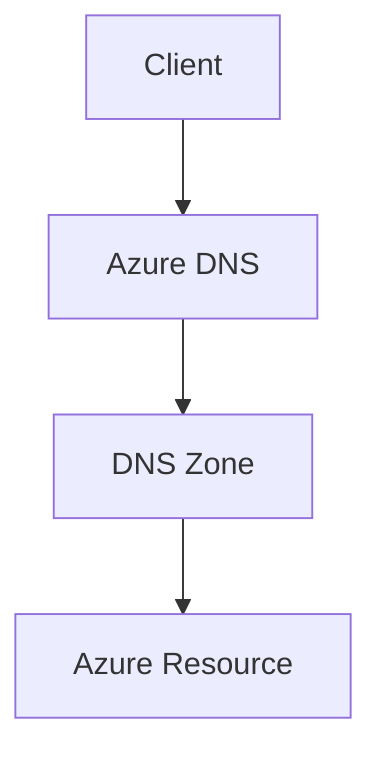

# 🌍 Azure DNS

> Name resolution services and DNS administration in Azure.

---

# 📚 Table of Contents

- [🌍 Azure DNS](#-azure-dns)
- [📚 Table of Contents](#-table-of-contents)
- [📌 Overview](#-overview)
- [🏗️ DNS Architecture](#️-dns-architecture)
- [🔑 Core Concepts](#-core-concepts)
- [⚙️ DNS Administration](#️-dns-administration)
  - [Common Tasks](#common-tasks)
- [📊 DNS Record Types](#-dns-record-types)
- [🧪 Azure CLI Examples](#-azure-cli-examples)
  - [Create DNS Zone](#create-dns-zone)
  - [Create A Record](#create-a-record)
- [🧪 PowerShell Examples](#-powershell-examples)
  - [Create DNS Zone](#create-dns-zone-1)
- [🚨 Common Issues](#-common-issues)
  - [DNS Resolution Failure](#dns-resolution-failure)
    - [Possible Causes](#possible-causes)
  - [Private DNS Not Resolving](#private-dns-not-resolving)
    - [Common Causes](#common-causes)
- [✅ Best Practices](#-best-practices)
- [📖 References](#-references)

---

# 📌 Overview

Azure DNS hosts DNS domains and provides name resolution using Azure infrastructure.

Azure DNS supports:

- Public DNS zones
- Private DNS zones
- Hybrid name resolution
- Custom domain hosting

---

# 🏗️ DNS Architecture



---

# 🔑 Core Concepts

| Component | Description |
|---|---|
| DNS Zone | Domain namespace |
| Record Set | DNS entries |
| Public DNS | Internet-facing resolution |
| Private DNS | Internal Azure resolution |

---

# ⚙️ DNS Administration

## Common Tasks

- Create DNS zones
- Add DNS records
- Configure private DNS
- Link VNets
- Configure custom domains

---

# 📊 DNS Record Types

| Record Type | Purpose |
|---|---|
| A | IPv4 mapping |
| AAAA | IPv6 mapping |
| CNAME | Alias |
| MX | Mail routing |
| TXT | Verification |

---

# 🧪 Azure CLI Examples

## Create DNS Zone

```bash
az network dns zone create \
  --resource-group Production-RG \
  --name contoso.com
```

## Create A Record

```bash
az network dns record-set a add-record \
  --resource-group Production-RG \
  --zone-name contoso.com \
  --record-set-name www \
  --ipv4-address 10.0.1.4
```

---

# 🧪 PowerShell Examples

## Create DNS Zone

```powershell
New-AzDnsZone `
-Name "contoso.com" `
-ResourceGroupName "Production-RG"
```

---

# 🚨 Common Issues

## DNS Resolution Failure

### Possible Causes

- Incorrect DNS record
- DNS propagation delay
- VNet DNS misconfiguration
- Missing private DNS link

---

## Private DNS Not Resolving

### Common Causes

- VNet not linked
- Incorrect zone name
- DNS caching issue

---

# ✅ Best Practices

- Use private DNS for internal workloads
- Document DNS records
- Use low TTL during migrations
- Separate public and private zones
- Monitor DNS changes

---

# 📖 References

- [Azure DNS Documentation](https://learn.microsoft.com/en-us/azure/dns/dns-overview?utm_source=chatgpt.com)
- [Azure Private DNS Documentation](https://learn.microsoft.com/en-us/azure/dns/private-dns-overview?utm_source=chatgpt.com)
- [Azure DNS Best Practices](https://learn.microsoft.com/en-us/azure/architecture/best-practices/networking?utm_source=chatgpt.com)

---