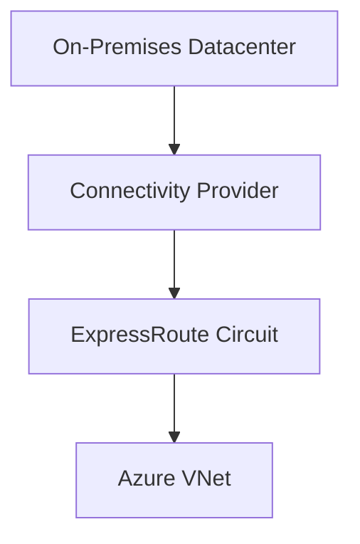

# 🚄 ExpressRoute

> Private dedicated connectivity between on-premises infrastructure and Azure.

---

# 📚 Table of Contents

- [� ExpressRoute](#-expressroute)
- [📚 Table of Contents](#-table-of-contents)
- [📌 Overview](#-overview)
- [🏗️ ExpressRoute Architecture](#️-expressroute-architecture)
- [🔑 Core Concepts](#-core-concepts)
- [⚙️ ExpressRoute Components](#️-expressroute-components)
  - [Peering Types](#peering-types)
- [📊 Connectivity Models](#-connectivity-models)
- [🧪 Azure CLI Examples](#-azure-cli-examples)
  - [Create ExpressRoute Circuit](#create-expressroute-circuit)
- [🚨 Common Issues](#-common-issues)
  - [Circuit Provisioning Failure](#circuit-provisioning-failure)
    - [Possible Causes](#possible-causes)
  - [Connectivity Failure](#connectivity-failure)
    - [Common Causes](#common-causes)
- [✅ Best Practices](#-best-practices)
- [📖 References](#-references)

---

# 📌 Overview

Azure ExpressRoute provides private, dedicated connectivity to Microsoft cloud services.

Benefits include:

- Lower latency
- Higher reliability
- Increased security
- Predictable performance

---

# 🏗️ ExpressRoute Architecture



---

# 🔑 Core Concepts

| Component | Description |
|---|---|
| Circuit | Dedicated connection |
| Peering | Traffic type configuration |
| Gateway | VNet connectivity |
| Provider | Connectivity partner |

---

# ⚙️ ExpressRoute Components

## Peering Types

| Peering | Usage |
|---|---|
| Private Peering | VNet connectivity |
| Microsoft Peering | Microsoft SaaS services |

---

# 📊 Connectivity Models

| Model | Description |
|---|---|
| Any-to-Any | WAN integration |
| Point-to-Point | Direct connection |
| Co-location | Provider datacenter |

---

# 🧪 Azure CLI Examples

## Create ExpressRoute Circuit

```bash
az network express-route create \
  --resource-group Production-RG \
  --name Prod-ER
```

---

# 🚨 Common Issues

## Circuit Provisioning Failure

### Possible Causes

- Provider configuration delay
- Incorrect service key
- Bandwidth mismatch

---

## Connectivity Failure

### Common Causes

- BGP issue
- Route advertisement mismatch
- Gateway misconfiguration

---

# ✅ Best Practices

- Use redundant circuits
- Monitor BGP health
- Plan IP addressing carefully
- Use ExpressRoute FastPath when applicable
- Test failover regularly

---

# 📖 References

- [Azure ExpressRoute Documentation](https://learn.microsoft.com/en-us/azure/expressroute/expressroute-introduction?utm_source=chatgpt.com)
- [ExpressRoute Connectivity Models](https://learn.microsoft.com/en-us/azure/expressroute/expressroute-connectivity-models?utm_source=chatgpt.com)
- [ExpressRoute FAQ](https://learn.microsoft.com/en-us/azure/expressroute/expressroute-faqs?utm_source=chatgpt.com)

---