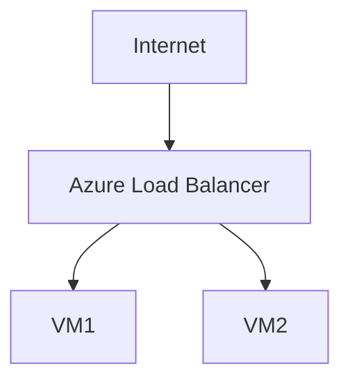

# ⚖️ Azure Load Balancer

> High availability and traffic distribution using Azure Load Balancer.

---

# 📚 Table of Contents

- [⚖️ Azure Load Balancer](#️-azure-load-balancer)
- [📚 Table of Contents](#-table-of-contents)
- [📌 Overview](#-overview)
- [🏗️ Load Balancer Architecture](#️-load-balancer-architecture)
- [🔑 Core Concepts](#-core-concepts)
- [⚙️ Load Balancer Components](#️-load-balancer-components)
  - [Common Tasks](#common-tasks)
- [📊 Load Balancer SKUs](#-load-balancer-skus)
- [🧪 Azure CLI Examples](#-azure-cli-examples)
  - [Create Load Balancer](#create-load-balancer)
  - [Create Health Probe](#create-health-probe)
- [🧪 PowerShell Examples](#-powershell-examples)
  - [Create Load Balancer](#create-load-balancer-1)
- [🚨 Common Issues](#-common-issues)
  - [Backend VM Unhealthy](#backend-vm-unhealthy)
    - [Possible Causes](#possible-causes)
  - [Traffic Not Distributed](#traffic-not-distributed)
    - [Common Causes](#common-causes)
- [✅ Best Practices](#-best-practices)
- [📖 References](#-references)

---

# 📌 Overview

Azure Load Balancer distributes network traffic across multiple backend resources.

Common use cases:

- High availability
- Traffic distribution
- Fault tolerance
- Application scalability

---

# 🏗️ Load Balancer Architecture



---

# 🔑 Core Concepts

| Component | Description |
|---|---|
| Frontend IP | Client-facing endpoint |
| Backend Pool | Target resources |
| Health Probe | Resource monitoring |
| Load Balancing Rule | Traffic distribution |

---

# ⚙️ Load Balancer Components

## Common Tasks

- Configure frontend IPs
- Add backend pools
- Configure health probes
- Configure balancing rules

---

# 📊 Load Balancer SKUs

| SKU | Usage |
|---|---|
| Basic | Small/simple workloads |
| Standard | Production workloads |

---

# 🧪 Azure CLI Examples

## Create Load Balancer

```bash
az network lb create \
  --resource-group Production-RG \
  --name Prod-LB
```

## Create Health Probe

```bash
az network lb probe create \
  --resource-group Production-RG \
  --lb-name Prod-LB \
  --name HTTP-Probe \
  --protocol tcp \
  --port 80
```

---

# 🧪 PowerShell Examples

## Create Load Balancer

```powershell
New-AzLoadBalancer `
-Name "Prod-LB" `
-ResourceGroupName "Production-RG"
```

---

# 🚨 Common Issues

## Backend VM Unhealthy

### Possible Causes

- NSG blocking probe
- Application down
- Incorrect probe configuration

---

## Traffic Not Distributed

### Common Causes

- Misconfigured backend pool
- Session persistence issue
- Health probe failure

---

# ✅ Best Practices

- Use Standard SKU
- Configure health probes properly
- Use Availability Zones
- Monitor backend health
- Restrict unnecessary inbound access

---

# 📖 References

- [Azure Load Balancer Documentation](https://learn.microsoft.com/en-us/azure/load-balancer/load-balancer-overview?utm_source=chatgpt.com)
- [Azure Load Balancer Health Probes](https://learn.microsoft.com/en-us/azure/load-balancer/load-balancer-custom-probe-overview?utm_source=chatgpt.com)
- [Azure Networking Best Practices](https://learn.microsoft.com/en-us/azure/architecture/best-practices/networking?utm_source=chatgpt.com)

---