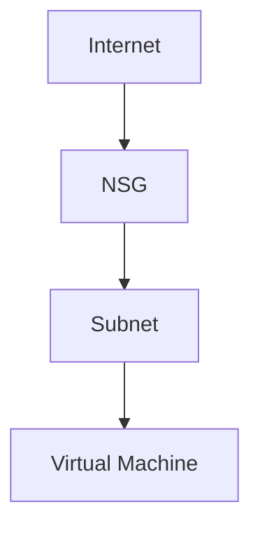

# 🔥 Network Security Groups (NSG)

> Control inbound and outbound Azure network traffic using Network Security Groups.

---

# 📚 Table of Contents

- [� Network Security Groups (NSG)](#-network-security-groups-nsg)
- [📚 Table of Contents](#-table-of-contents)
- [📌 Overview](#-overview)
- [🏗️ NSG Architecture](#️-nsg-architecture)
- [🔑 Core Concepts](#-core-concepts)
- [⚙️ NSG Rules](#️-nsg-rules)
  - [Rule Components](#rule-components)
- [📊 Rule Processing](#-rule-processing)
- [🧪 Azure CLI Examples](#-azure-cli-examples)
  - [Create NSG](#create-nsg)
  - [Create NSG Rule](#create-nsg-rule)
- [🧪 PowerShell Examples](#-powershell-examples)
  - [Create NSG](#create-nsg-1)
- [🚨 Common Issues](#-common-issues)
  - [VM Unreachable](#vm-unreachable)
    - [Possible Causes](#possible-causes)
  - [Application Connectivity Failure](#application-connectivity-failure)
    - [Common Causes](#common-causes)
- [✅ Best Practices](#-best-practices)
- [📖 References](#-references)

---

# 📌 Overview

Network Security Groups (NSGs) filter Azure network traffic using security rules.

NSGs can control:

- Inbound traffic
- Outbound traffic
- Port access
- Protocol access
- Source/destination filtering

---

# 🏗️ NSG Architecture



---

# 🔑 Core Concepts

| Component | Description |
|---|---|
| Security Rule | Traffic filter |
| Priority | Rule evaluation order |
| Source/Destination | Traffic endpoints |
| Allow/Deny | Rule action |

---

# ⚙️ NSG Rules

## Rule Components

- Source IP
- Destination IP
- Protocol
- Port
- Action
- Priority

---

# 📊 Rule Processing

| Priority | Evaluation |
|---|---|
| Lower Number | Higher Priority |
| First Match Wins | Processing stops |

---

# 🧪 Azure CLI Examples

## Create NSG

```bash
az network nsg create \
  --resource-group Production-RG \
  --name Web-NSG
```

## Create NSG Rule

```bash
az network nsg rule create \
  --resource-group Production-RG \
  --nsg-name Web-NSG \
  --name Allow-HTTP \
  --priority 100 \
  --destination-port-ranges 80 \
  --access Allow
```

---

# 🧪 PowerShell Examples

## Create NSG

```powershell
New-AzNetworkSecurityGroup `
-Name "Web-NSG" `
-ResourceGroupName "Production-RG"
```

---

# 🚨 Common Issues

## VM Unreachable

### Possible Causes

- NSG deny rule
- Incorrect priority
- Missing allow rule
- Subnet NSG conflict

---

## Application Connectivity Failure

### Common Causes

- Outbound traffic blocked
- Incorrect protocol rule
- Port mismatch

---

# ✅ Best Practices

- Use least privilege rules
- Avoid overly permissive access
- Document NSG rules
- Use Application Security Groups
- Review unused rules regularly

---

# 📖 References

- [Azure NSG Documentation](https://learn.microsoft.com/en-us/azure/virtual-network/network-security-groups-overview?utm_source=chatgpt.com)
- [Azure NSG Best Practices](https://learn.microsoft.com/en-us/azure/architecture/reference-architectures/hybrid-networking/network-level-segmentation?utm_source=chatgpt.com)
- [Azure Application Security Groups Documentation](https://learn.microsoft.com/en-us/azure/virtual-network/application-security-groups?utm_source=chatgpt.com)

---