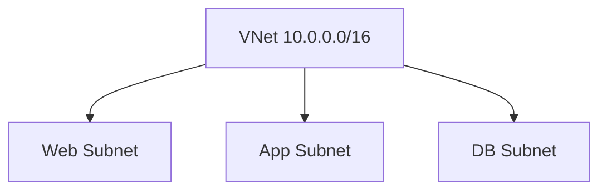

# 🧩 Subnets

> Network segmentation and workload isolation using Azure Subnets.

---

# 📚 Table of Contents

- [🧩 Subnets](#-subnets)
- [📚 Table of Contents](#-table-of-contents)
- [📌 Overview](#-overview)
- [🏗️ Subnet Architecture](#️-subnet-architecture)
- [🔑 Core Concepts](#-core-concepts)
- [⚙️ Subnet Administration](#️-subnet-administration)
  - [Common Tasks](#common-tasks)
- [📊 Subnet Planning](#-subnet-planning)
- [🧪 Azure CLI Examples](#-azure-cli-examples)
  - [Create Subnet](#create-subnet)
- [🧪 PowerShell Examples](#-powershell-examples)
  - [Create Subnet](#create-subnet-1)
- [🚨 Common Issues](#-common-issues)
  - [IP Address Exhaustion](#ip-address-exhaustion)
    - [Possible Causes](#possible-causes)
  - [Subnet Delegation Conflict](#subnet-delegation-conflict)
    - [Common Causes](#common-causes)
- [✅ Best Practices](#-best-practices)
- [📖 References](#-references)

---

# 📌 Overview

Subnets divide VNets into smaller logical segments.

Subnet segmentation improves:

- Security
- Traffic isolation
- Workload organization
- Routing control

---

# 🏗️ Subnet Architecture



---

# 🔑 Core Concepts

| Component | Description |
|---|---|
| CIDR Block | IP allocation |
| NSG Association | Security filtering |
| Route Table | Traffic routing |
| Delegation | Service integration |

---

# ⚙️ Subnet Administration

## Common Tasks

- Create subnets
- Associate NSGs
- Associate route tables
- Configure subnet delegation

---

# 📊 Subnet Planning

| Subnet | Example |
|---|---|
| Web | 10.0.1.0/24 |
| App | 10.0.2.0/24 |
| Database | 10.0.3.0/24 |

---

# 🧪 Azure CLI Examples

## Create Subnet

```bash
az network vnet subnet create \
  --resource-group Production-RG \
  --vnet-name Prod-VNet \
  --name Web-Subnet \
  --address-prefixes 10.0.1.0/24
```

---

# 🧪 PowerShell Examples

## Create Subnet

```powershell
Add-AzVirtualNetworkSubnetConfig `
-Name "Web-Subnet"
```

---

# 🚨 Common Issues

## IP Address Exhaustion

### Possible Causes

- Small subnet range
- Poor IP planning
- High VM density

---

## Subnet Delegation Conflict

### Common Causes

- Unsupported service
- Existing resource dependency

---

# ✅ Best Practices

- Reserve space for growth
- Separate workloads logically
- Use dedicated subnets for critical services
- Apply NSGs consistently
- Document subnet allocations

---

# 📖 References

- [Azure Subnets Documentation](https://learn.microsoft.com/en-us/azure/virtual-network/virtual-network-manage-subnet?utm_source=chatgpt.com)
- [Azure IP Address Planning Guide](https://learn.microsoft.com/en-us/azure/cloud-adoption-framework/ready/azure-best-practices/plan-for-ip-addressing?utm_source=chatgpt.com)

---