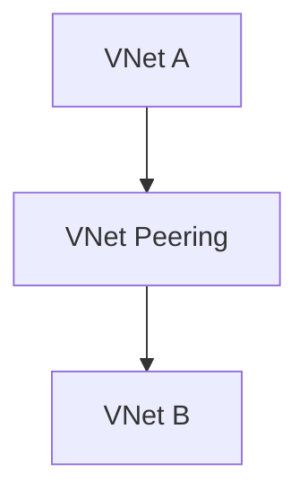

# 🔗 VNet Peering

> Connect Azure Virtual Networks securely using low-latency private networking.

---

# 📚 Table of Contents

- [� VNet Peering](#-vnet-peering)
- [📚 Table of Contents](#-table-of-contents)
- [📌 Overview](#-overview)
- [🏗️ Peering Architecture](#️-peering-architecture)
- [🔑 Core Concepts](#-core-concepts)
- [⚙️ Peering Configuration](#️-peering-configuration)
  - [Common Tasks](#common-tasks)
- [📊 Peering Types](#-peering-types)
- [🧪 Azure CLI Examples](#-azure-cli-examples)
  - [Create VNet Peering](#create-vnet-peering)
- [🧪 PowerShell Examples](#-powershell-examples)
  - [Create Peering](#create-peering)
- [🚨 Common Issues](#-common-issues)
  - [Peering Connection Failed](#peering-connection-failed)
    - [Possible Causes](#possible-causes)
  - [Traffic Not Routing](#traffic-not-routing)
    - [Common Causes](#common-causes)
- [✅ Best Practices](#-best-practices)
- [📖 References](#-references)

---

# 📌 Overview

VNet Peering connects Azure VNets using the Microsoft backbone network.

Benefits include:

- Low latency
- High bandwidth
- Private communication
- Cross-region connectivity

---

# 🏗️ Peering Architecture



---

# 🔑 Core Concepts

| Component | Description |
|---|---|
| Local Peering | Same-region connectivity |
| Global Peering | Cross-region connectivity |
| Gateway Transit | Shared VPN/ER gateway |
| Remote Gateway | Use peered gateway |

---

# ⚙️ Peering Configuration

## Common Tasks

- Create peering
- Enable gateway transit
- Configure forwarded traffic
- Configure remote gateway usage

---

# 📊 Peering Types

| Type | Description |
|---|---|
| Regional Peering | Same region |
| Global Peering | Different regions |

---

# 🧪 Azure CLI Examples

## Create VNet Peering

```bash
az network vnet peering create \
  --resource-group Production-RG \
  --name Prod-To-Dev \
  --vnet-name Prod-VNet \
  --remote-vnet Dev-VNet
```

---

# 🧪 PowerShell Examples

## Create Peering

```powershell
Add-AzVirtualNetworkPeering `
-Name "Prod-To-Dev"
```

---

# 🚨 Common Issues

## Peering Connection Failed

### Possible Causes

- Overlapping IP ranges
- Missing permissions
- Incorrect gateway configuration

---

## Traffic Not Routing

### Common Causes

- NSG blocking traffic
- UDR conflict
- Gateway transit disabled

---

# ✅ Best Practices

- Avoid overlapping CIDRs
- Use hub-and-spoke topology
- Monitor peering costs
- Document peering relationships
- Apply NSGs carefully

---

# 📖 References

- [Azure VNet Peering Documentation](https://learn.microsoft.com/en-us/azure/virtual-network/virtual-network-peering-overview?utm_source=chatgpt.com)
- [Global VNet Peering Documentation](https://learn.microsoft.com/en-us/azure/virtual-network/virtual-network-peering-overview?utm_source=chatgpt.com#global-peering)
- [Hub-and-Spoke Architecture Guide](https://learn.microsoft.com/en-us/azure/architecture/networking/architecture/hub-spoke?utm_source=chatgpt.com)

---