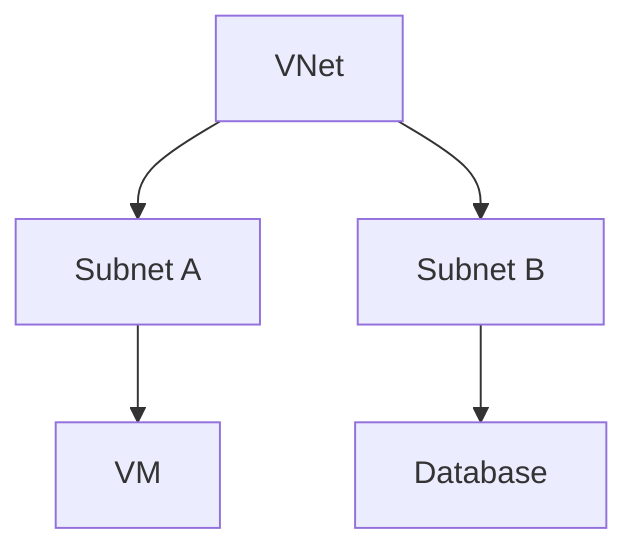

# 🌐 Virtual Networks (VNets)

> Core Azure networking infrastructure for secure cloud communication.

---

# 📚 Table of Contents

- [🌐 Virtual Networks (VNets)](#-virtual-networks-vnets)
- [📚 Table of Contents](#-table-of-contents)
- [📌 Overview](#-overview)
- [🏗️ VNet Architecture](#️-vnet-architecture)
- [🔑 Core Concepts](#-core-concepts)
- [⚙️ VNet Administration](#️-vnet-administration)
  - [Common Tasks](#common-tasks)
- [📊 Address Spaces](#-address-spaces)
- [🧪 Azure CLI Examples](#-azure-cli-examples)
  - [Create VNet](#create-vnet)
- [🧪 PowerShell Examples](#-powershell-examples)
  - [Create VNet](#create-vnet-1)
- [🚨 Common Issues](#-common-issues)
  - [Connectivity Failure](#connectivity-failure)
    - [Possible Causes](#possible-causes)
  - [Overlapping Address Spaces](#overlapping-address-spaces)
    - [Common Causes](#common-causes)
- [✅ Best Practices](#-best-practices)
- [📖 References](#-references)

---

# 📌 Overview

Azure Virtual Networks (VNets) provide isolated and secure networking environments for Azure resources.

VNets support:

- Private IP communication
- Hybrid connectivity
- Network segmentation
- Secure application hosting

---

# 🏗️ VNet Architecture



---

# 🔑 Core Concepts

| Component | Description |
|---|---|
| Address Space | CIDR network range |
| Subnet | Segmented network |
| NIC | VM network interface |
| Peering | VNet connectivity |

---

# ⚙️ VNet Administration

## Common Tasks

- Create VNets
- Configure subnets
- Configure DNS
- Configure peering
- Apply NSGs

---

# 📊 Address Spaces

| CIDR | Hosts |
|---|---|
| /24 | 256 |
| /25 | 128 |
| /26 | 64 |

---

# 🧪 Azure CLI Examples

## Create VNet

```bash
az network vnet create \
  --resource-group Production-RG \
  --name Prod-VNet \
  --address-prefix 10.0.0.0/16
```

---

# 🧪 PowerShell Examples

## Create VNet

```powershell
New-AzVirtualNetwork `
-Name "Prod-VNet" `
-ResourceGroupName "Production-RG"
```

---

# 🚨 Common Issues

## Connectivity Failure

### Possible Causes

- NSG blocking traffic
- Incorrect routes
- DNS resolution failure
- Peering misconfiguration

---

## Overlapping Address Spaces

### Common Causes

- Poor IP planning
- Hybrid network conflicts

---

# ✅ Best Practices

- Use proper IP planning
- Segment workloads by subnet
- Apply NSGs
- Use private endpoints
- Avoid overlapping CIDRs

---

# 📖 References

- [Azure Virtual Network Documentation](https://learn.microsoft.com/en-us/azure/virtual-network/virtual-networks-overview?utm_source=chatgpt.com)
- [Azure Networking Documentation](https://learn.microsoft.com/en-us/azure/networking/?utm_source=chatgpt.com)
- [VNet Best Practices](https://learn.microsoft.com/en-us/azure/cloud-adoption-framework/ready/azure-best-practices/plan-for-ip-addressing?utm_source=chatgpt.com)

---