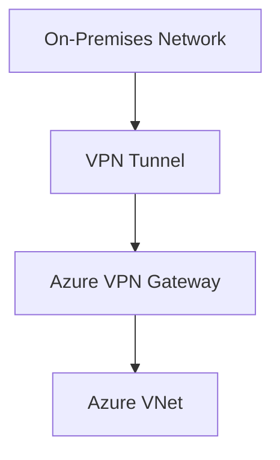

# 🔐 VPN Gateway

> Secure hybrid connectivity between on-premises networks and Azure using VPN Gateway.

---

# 📚 Table of Contents

- [� VPN Gateway](#-vpn-gateway)
- [📚 Table of Contents](#-table-of-contents)
- [📌 Overview](#-overview)
- [🏗️ VPN Gateway Architecture](#️-vpn-gateway-architecture)
- [🔑 Core Concepts](#-core-concepts)
- [⚙️ VPN Types](#️-vpn-types)
- [📊 Gateway SKUs](#-gateway-skus)
- [🧪 Azure CLI Examples](#-azure-cli-examples)
  - [Create VPN Gateway](#create-vpn-gateway)
  - [Create Local Network Gateway](#create-local-network-gateway)
- [🧪 PowerShell Examples](#-powershell-examples)
  - [Create VPN Gateway](#create-vpn-gateway-1)
- [🚨 Common Issues](#-common-issues)
  - [VPN Tunnel Down](#vpn-tunnel-down)
    - [Possible Causes](#possible-causes)
  - [Intermittent Connectivity](#intermittent-connectivity)
    - [Common Causes](#common-causes)
- [✅ Best Practices](#-best-practices)
- [📖 References](#-references)

---

# 📌 Overview

Azure VPN Gateway provides encrypted connectivity between Azure VNets and external networks.

Common scenarios:

- Hybrid connectivity
- Branch office connectivity
- Remote user access
- Secure site-to-site tunnels

---

# 🏗️ VPN Gateway Architecture



---

# 🔑 Core Concepts

| Component | Description |
|---|---|
| VPN Gateway | Azure VPN endpoint |
| Local Network Gateway | On-premises network definition |
| Tunnel | Encrypted connection |
| Gateway Subnet | Dedicated subnet for gateway |

---

# ⚙️ VPN Types

| VPN Type | Usage |
|---|---|
| Site-to-Site | Hybrid connectivity |
| Point-to-Site | Remote user access |
| VNet-to-VNet | Azure network connectivity |

---

# 📊 Gateway SKUs

| SKU | Usage |
|---|---|
| VpnGw1 | Small workloads |
| VpnGw2 | Medium workloads |
| VpnGw3 | Enterprise workloads |

---

# 🧪 Azure CLI Examples

## Create VPN Gateway

```bash
az network vnet-gateway create \
  --resource-group Production-RG \
  --name Prod-VPNGW
```

## Create Local Network Gateway

```bash
az network local-gateway create \
  --resource-group Production-RG \
  --name HQ-Network
```

---

# 🧪 PowerShell Examples

## Create VPN Gateway

```powershell
New-AzVirtualNetworkGateway `
-Name "Prod-VPNGW" `
-ResourceGroupName "Production-RG"
```

---

# 🚨 Common Issues

## VPN Tunnel Down

### Possible Causes

- Shared key mismatch
- Firewall blocking IPsec
- Incorrect local gateway IP
- Routing mismatch

---

## Intermittent Connectivity

### Common Causes

- ISP instability
- MTU mismatch
- Packet fragmentation

---

# ✅ Best Practices

- Use active-active gateways
- Monitor tunnel health
- Use BGP when possible
- Protect shared keys securely
- Use redundant on-premises devices

---

# 📖 References

- [Azure VPN Gateway Documentation](https://learn.microsoft.com/en-us/azure/vpn-gateway/vpn-gateway-about-vpngateways?utm_source=chatgpt.com)
- [Site-to-Site VPN Documentation](https://learn.microsoft.com/en-us/azure/vpn-gateway/tutorial-site-to-site-portal?utm_source=chatgpt.com)
- [Point-to-Site VPN Documentation](https://learn.microsoft.com/en-us/azure/vpn-gateway/point-to-site-about?utm_source=chatgpt.com)

---