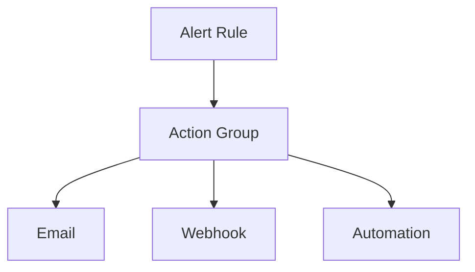

# 📢 Action Groups

> Notification and automation targets for Azure Monitor alerts.

---

# 📚 Table of Contents

- [� Action Groups](#-action-groups)
- [📚 Table of Contents](#-table-of-contents)
- [📌 Overview](#-overview)
- [🏗️ Action Group Architecture](#️-action-group-architecture)
- [🔑 Core Concepts](#-core-concepts)
- [⚙️ Notification Types](#️-notification-types)
- [📊 Automation Scenarios](#-automation-scenarios)
- [🧪 Azure CLI Examples](#-azure-cli-examples)
  - [Create Action Group](#create-action-group)
- [🚨 Common Issues](#-common-issues)
  - [Notifications Not Sent](#notifications-not-sent)
    - [Possible Causes](#possible-causes)
  - [Webhook Failure](#webhook-failure)
    - [Common Causes](#common-causes)
- [✅ Best Practices](#-best-practices)
- [📖 References](#-references)

---

# 📌 Overview

Action Groups define notification and automation actions triggered by Azure Alerts.

Common actions include:

- Email notifications
- SMS messages
- Webhooks
- Logic Apps
- Azure Functions

---

# 🏗️ Action Group Architecture



---

# 🔑 Core Concepts

| Component | Description |
|---|---|
| Notification | Human response |
| Automation | Automated remediation |
| Receiver | Action target |
| Webhook | External integration |

---

# ⚙️ Notification Types

| Type | Usage |
|---|---|
| Email | Admin notifications |
| SMS | Critical alerts |
| Webhook | Integration |
| Logic App | Automation |

---

# 📊 Automation Scenarios

| Scenario | Action |
|---|---|
| VM CPU High | Scale out |
| VM Down | Restart VM |
| Security Alert | Trigger incident workflow |

---

# 🧪 Azure CLI Examples

## Create Action Group

```bash
az monitor action-group create \
  --resource-group Production-RG \
  --name InfraAlerts
```

---

# 🚨 Common Issues

## Notifications Not Sent

### Possible Causes

- Incorrect receiver configuration
- Email filtering
- Action group disabled

---

## Webhook Failure

### Common Causes

- Endpoint unavailable
- Authentication issue
- Timeout

---

# ✅ Best Practices

- Separate action groups by severity
- Use automation carefully
- Test notifications regularly
- Document escalation paths
- Use webhooks securely

---

# 📖 References

- [Azure Action Groups Documentation](https://learn.microsoft.com/en-us/azure/azure-monitor/alerts/action-groups?utm_source=chatgpt.com)
- [Azure Monitor Automation Documentation](https://learn.microsoft.com/en-us/azure/azure-monitor/alerts/action-groups?utm_source=chatgpt.com#automation-runbooks)

---