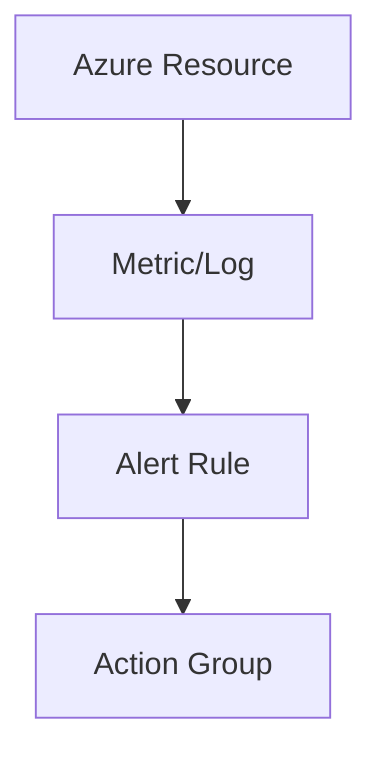

# 🚨 Alerts

> Automated monitoring notifications and incident detection in Azure.

---

# 📚 Table of Contents

- [� Alerts](#-alerts)
- [📚 Table of Contents](#-table-of-contents)
- [📌 Overview](#-overview)
- [🏗️ Alerts Architecture](#️-alerts-architecture)
- [🔑 Core Concepts](#-core-concepts)
- [⚙️ Alert Types](#️-alert-types)
- [📊 Alert Severity Levels](#-alert-severity-levels)
- [🧪 Azure CLI Examples](#-azure-cli-examples)
  - [Create Metric Alert](#create-metric-alert)
- [🚨 Common Issues](#-common-issues)
  - [Alert Not Triggering](#alert-not-triggering)
    - [Possible Causes](#possible-causes)
  - [Alert Storm](#alert-storm)
    - [Common Causes](#common-causes)
- [✅ Best Practices](#-best-practices)
- [📖 References](#-references)

---

# 📌 Overview

Azure Alerts notify administrators when specific conditions occur.

Alerts help organizations:

- Detect failures
- Respond to incidents
- Monitor performance
- Automate remediation

---

# 🏗️ Alerts Architecture



---

# 🔑 Core Concepts

| Component | Description |
|---|---|
| Alert Rule | Trigger condition |
| Action Group | Notification target |
| Severity | Incident importance |
| Signal | Monitoring data source |

---

# ⚙️ Alert Types

| Alert Type | Example |
|---|---|
| Metric Alert | CPU threshold |
| Log Alert | Failed sign-ins |
| Activity Log Alert | Resource deletion |

---

# 📊 Alert Severity Levels

| Severity | Description |
|---|---|
| Sev 0 | Critical outage |
| Sev 1 | Major issue |
| Sev 2 | Warning |
| Sev 3 | Informational |

---

# 🧪 Azure CLI Examples

## Create Metric Alert

```bash
az monitor metrics alert create \
  --name HighCPUAlert \
  --resource-group Production-RG
```

---

# 🚨 Common Issues

## Alert Not Triggering

### Possible Causes

- Incorrect threshold
- Wrong scope
- Missing metrics

---

## Alert Storm

### Common Causes

- Aggressive thresholds
- Missing suppression rules
- Short evaluation frequency

---

# ✅ Best Practices

- Use meaningful thresholds
- Configure action groups
- Avoid excessive alerts
- Use severity classification
- Test alerts regularly

---

# 📖 References

- [Azure Alerts Documentation](https://learn.microsoft.com/en-us/azure/azure-monitor/alerts/alerts-overview?utm_source=chatgpt.com)
- [Azure Monitor Alerts Best Practices](https://learn.microsoft.com/en-us/azure/azure-monitor/alerts/alerts-best-practices?utm_source=chatgpt.com)

---