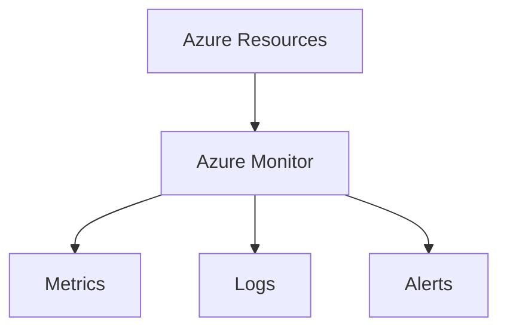

# 📊 Azure Monitor

> Centralized monitoring platform for Azure resources, applications, and infrastructure.

---

# 📚 Table of Contents

- [� Azure Monitor](#-azure-monitor)
- [📚 Table of Contents](#-table-of-contents)
- [📌 Overview](#-overview)
- [🏗️ Azure Monitor Architecture](#️-azure-monitor-architecture)
- [🔑 Core Concepts](#-core-concepts)
- [⚙️ Monitoring Components](#️-monitoring-components)
  - [Core Services](#core-services)
- [📊 Monitoring Data Types](#-monitoring-data-types)
- [🧪 Azure CLI Examples](#-azure-cli-examples)
  - [List Metrics](#list-metrics)
- [🚨 Common Issues](#-common-issues)
  - [Missing Metrics](#missing-metrics)
    - [Possible Causes](#possible-causes)
  - [Delayed Alerts](#delayed-alerts)
    - [Common Causes](#common-causes)
- [✅ Best Practices](#-best-practices)
- [📖 References](#-references)

---

# 📌 Overview

Azure Monitor collects, analyzes, and acts on telemetry from Azure environments.

Azure Monitor supports:

- Metrics collection
- Log collection
- Alerting
- Visualization
- Automation

---

# 🏗️ Azure Monitor Architecture



---

# 🔑 Core Concepts

| Component | Description |
|---|---|
| Metrics | Numeric performance data |
| Logs | Detailed event data |
| Alerts | Automated notifications |
| Workbooks | Data visualization |

---

# ⚙️ Monitoring Components

## Core Services

- Azure Monitor
- Log Analytics
- Application Insights
- Alerts
- Action Groups

---

# 📊 Monitoring Data Types

| Type | Example |
|---|---|
| Metrics | CPU usage |
| Activity Logs | Subscription events |
| Resource Logs | NSG flow logs |

---

# 🧪 Azure CLI Examples

## List Metrics

```bash
az monitor metrics list \
  --resource WebVM01
```

---

# 🚨 Common Issues

## Missing Metrics

### Possible Causes

- Monitoring disabled
- Incorrect scope
- Resource unsupported

---

## Delayed Alerts

### Common Causes

- Evaluation frequency
- Ingestion latency
- Misconfigured rules

---

# ✅ Best Practices

- Centralize monitoring
- Configure alert thresholds carefully
- Retain logs appropriately
- Monitor critical workloads
- Use dashboards and workbooks

---

# 📖 References

- [Azure Monitor Documentation](https://learn.microsoft.com/en-us/azure/azure-monitor/overview?utm_source=chatgpt.com)
- [Azure Monitor Best Practices](https://learn.microsoft.com/en-us/azure/azure-monitor/best-practices-monitoring?utm_source=chatgpt.com)

---