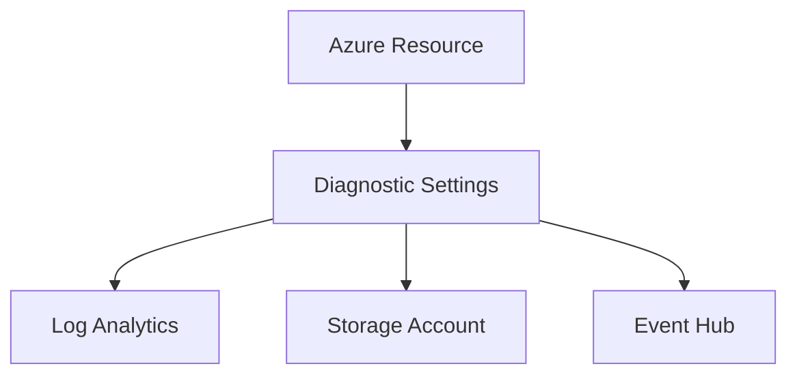

# 📝 Diagnostic Settings

> Configure Azure resource log and metric collection using Diagnostic Settings.

---

# 📚 Table of Contents

- [� Diagnostic Settings](#-diagnostic-settings)
- [📚 Table of Contents](#-table-of-contents)
- [📌 Overview](#-overview)
- [🏗️ Diagnostic Settings Architecture](#️-diagnostic-settings-architecture)
- [🔑 Core Concepts](#-core-concepts)
- [⚙️ Log Destinations](#️-log-destinations)
- [📊 Supported Data Types](#-supported-data-types)
- [🧪 Azure CLI Examples](#-azure-cli-examples)
  - [Create Diagnostic Setting](#create-diagnostic-setting)
- [🚨 Common Issues](#-common-issues)
  - [Logs Missing](#logs-missing)
    - [Possible Causes](#possible-causes)
  - [Storage Costs Increasing](#storage-costs-increasing)
    - [Common Causes](#common-causes)
- [✅ Best Practices](#-best-practices)
- [📖 References](#-references)

---

# 📌 Overview

Diagnostic Settings control how Azure resource logs and metrics are exported.

Supported destinations include:

- Log Analytics
- Storage Accounts
- Event Hubs

---

# 🏗️ Diagnostic Settings Architecture



---

# 🔑 Core Concepts

| Component | Description |
|---|---|
| Resource Logs | Operational events |
| Metrics | Performance telemetry |
| Retention | Data storage duration |
| Export Destination | Data target |

---

# ⚙️ Log Destinations

| Destination | Usage |
|---|---|
| Log Analytics | Central analysis |
| Storage Account | Long-term retention |
| Event Hub | SIEM integration |

---

# 📊 Supported Data Types

| Type | Example |
|---|---|
| Activity Logs | Subscription events |
| NSG Flow Logs | Network traffic |
| Audit Logs | Security events |

---

# 🧪 Azure CLI Examples

## Create Diagnostic Setting

```bash
az monitor diagnostic-settings create \
  --name VM-Diagnostics
```

---

# 🚨 Common Issues

## Logs Missing

### Possible Causes

- Diagnostic settings disabled
- Wrong destination
- Ingestion latency

---

## Storage Costs Increasing

### Common Causes

- Excessive retention
- High log volume
- Unfiltered diagnostic data

---

# ✅ Best Practices

- Centralize diagnostics
- Retain logs appropriately
- Enable diagnostics on critical resources
- Monitor ingestion costs
- Use lifecycle management for archived logs

---

# 📖 References

- [Diagnostic Settings Documentation](https://learn.microsoft.com/en-us/azure/azure-monitor/essentials/diagnostic-settings?utm_source=chatgpt.com)
- [Azure Monitor Logs Documentation](https://learn.microsoft.com/en-us/azure/azure-monitor/logs/data-platform-logs?utm_source=chatgpt.com)

---