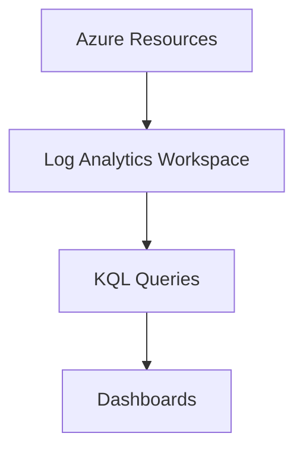

# 📜 Log Analytics

> Centralized log collection and query platform for Azure environments.

---

# 📚 Table of Contents

- [� Log Analytics](#-log-analytics)
- [📚 Table of Contents](#-table-of-contents)
- [📌 Overview](#-overview)
- [🏗️ Log Analytics Architecture](#️-log-analytics-architecture)
- [🔑 Core Concepts](#-core-concepts)
- [⚙️ Workspace Administration](#️-workspace-administration)
  - [Common Tasks](#common-tasks)
- [📊 KQL Queries](#-kql-queries)
  - [Example Query](#example-query)
- [🧪 Query Examples](#-query-examples)
  - [Failed Sign-ins](#failed-sign-ins)
- [🚨 Common Issues](#-common-issues)
  - [Logs Not Appearing](#logs-not-appearing)
    - [Possible Causes](#possible-causes)
  - [Query Performance Issues](#query-performance-issues)
    - [Common Causes](#common-causes)
- [✅ Best Practices](#-best-practices)
- [📖 References](#-references)

---

# 📌 Overview

Log Analytics stores and analyzes log data using Kusto Query Language (KQL).

It enables:

- Centralized logging
- Troubleshooting
- Security investigations
- Performance analysis

---

# 🏗️ Log Analytics Architecture



---

# 🔑 Core Concepts

| Component | Description |
|---|---|
| Workspace | Log storage location |
| KQL | Query language |
| Tables | Structured log data |
| Retention | Log storage duration |

---

# ⚙️ Workspace Administration

## Common Tasks

- Create workspaces
- Configure retention
- Connect resources
- Create queries
- Build dashboards

---

# 📊 KQL Queries

## Example Query

```kusto
Heartbeat
| summarize count() by Computer
```

---

# 🧪 Query Examples

## Failed Sign-ins

```kusto
SigninLogs
| where ResultType != 0
```

---

# 🚨 Common Issues

## Logs Not Appearing

### Possible Causes

- Diagnostic settings missing
- Workspace misconfiguration
- Data ingestion delay

---

## Query Performance Issues

### Common Causes

- Large datasets
- Inefficient queries
- Excessive joins

---

# ✅ Best Practices

- Use centralized workspaces
- Optimize KQL queries
- Configure retention policies
- Limit excessive ingestion
- Use RBAC for workspace access

---

# 📖 References

- [Log Analytics Documentation](https://learn.microsoft.com/en-us/azure/azure-monitor/logs/log-analytics-overview?utm_source=chatgpt.com)
- [KQL Documentation](https://learn.microsoft.com/en-us/azure/data-explorer/kusto/query/?utm_source=chatgpt.com)
- [Azure Monitor Logs Documentation](https://learn.microsoft.com/en-us/azure/azure-monitor/logs/data-platform-logs?utm_source=chatgpt.com)

---