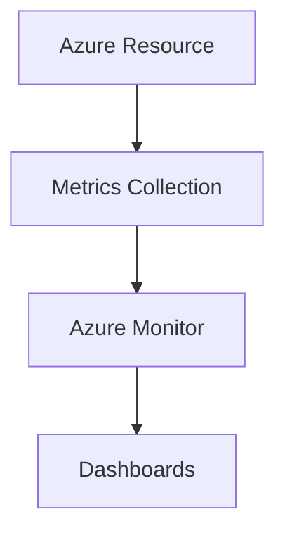

# 📈 Metrics

> Performance and health monitoring data for Azure resources.

---

# 📚 Table of Contents

- [� Metrics](#-metrics)
- [📚 Table of Contents](#-table-of-contents)
- [📌 Overview](#-overview)
- [🏗️ Metrics Architecture](#️-metrics-architecture)
- [🔑 Core Concepts](#-core-concepts)
- [⚙️ Metrics Collection](#️-metrics-collection)
  - [Common Metrics](#common-metrics)
- [📊 Common Metrics](#-common-metrics)
- [🧪 KQL Examples](#-kql-examples)
  - [VM CPU Usage](#vm-cpu-usage)
- [🚨 Common Issues](#-common-issues)
  - [Missing Metrics](#missing-metrics)
    - [Possible Causes](#possible-causes)
  - [Incorrect Aggregation](#incorrect-aggregation)
    - [Common Causes](#common-causes)
- [✅ Best Practices](#-best-practices)
- [📖 References](#-references)

---

# 📌 Overview

Azure Metrics provide near real-time performance telemetry for Azure resources.

Metrics are commonly used for:

- Monitoring
- Alerting
- Capacity planning
- Troubleshooting

---

# 🏗️ Metrics Architecture



---

# 🔑 Core Concepts

| Component | Description |
|---|---|
| Metric | Numeric telemetry |
| Namespace | Metric category |
| Aggregation | Data summarization |
| Dimension | Metric filtering |

---

# ⚙️ Metrics Collection

## Common Metrics

- CPU utilization
- Disk IOPS
- Memory usage
- Network throughput

---

# 📊 Common Metrics

| Resource | Example Metric |
|---|---|
| VM | Percentage CPU |
| Storage | Transactions |
| App Service | Requests |

---

# 🧪 KQL Examples

## VM CPU Usage

```kusto
Perf
| where CounterName == "% Processor Time"
```

---

# 🚨 Common Issues

## Missing Metrics

### Possible Causes

- Monitoring disabled
- Unsupported resource
- Ingestion delay

---

## Incorrect Aggregation

### Common Causes

- Wrong time granularity
- Incorrect metric dimension

---

# ✅ Best Practices

- Monitor critical metrics
- Use proper aggregation windows
- Combine metrics with logs
- Configure alert baselines
- Retain historical data appropriately

---

# 📖 References

- [Azure Metrics Documentation](https://learn.microsoft.com/en-us/azure/azure-monitor/essentials/data-platform-metrics?utm_source=chatgpt.com)
- [Azure Monitor Metrics Explorer](https://learn.microsoft.com/en-us/azure/azure-monitor/essentials/metrics-getting-started?utm_source=chatgpt.com)

---