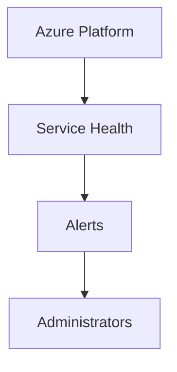

# ❤️ Service Health

> Monitor Azure service outages, maintenance events, and platform health issues.

---

# 📚 Table of Contents

- [❤️ Service Health](#️-service-health)
- [📚 Table of Contents](#-table-of-contents)
- [📌 Overview](#-overview)
- [🏗️ Service Health Architecture](#️-service-health-architecture)
- [🔑 Core Concepts](#-core-concepts)
- [⚙️ Service Health Components](#️-service-health-components)
  - [Core Features](#core-features)
- [📊 Event Types](#-event-types)
- [🧪 Monitoring Scenarios](#-monitoring-scenarios)
- [🚨 Common Issues](#-common-issues)
  - [Missing Service Alerts](#missing-service-alerts)
    - [Possible Causes](#possible-causes)
  - [Resource Health Unknown](#resource-health-unknown)
    - [Common Causes](#common-causes)
- [✅ Best Practices](#-best-practices)
- [📖 References](#-references)

---

# 📌 Overview

Azure Service Health provides personalized alerts and guidance for Azure platform issues.

It helps administrators:

- Monitor outages
- Track maintenance events
- Detect regional issues
- Respond to incidents faster

---

# 🏗️ Service Health Architecture

---

# 🔑 Core Concepts

| Component | Description |
|---|---|
| Service Issues | Active outages |
| Planned Maintenance | Scheduled updates |
| Health Advisories | Recommendations |
| Resource Health | Individual resource state |

---

# ⚙️ Service Health Components

## Core Features

- Personalized dashboards
- Regional outage alerts
- Planned maintenance tracking
- Service incident reports

---

# 📊 Event Types

| Event Type | Description |
|---|---|
| Service Issue | Active outage |
| Planned Maintenance | Scheduled event |
| Health Advisory | Optimization guidance |

---

# 🧪 Monitoring Scenarios

| Scenario | Response |
|---|---|
| Regional Outage | Failover workloads |
| Planned Maintenance | Schedule maintenance windows |
| Service Degradation | Investigate impact |

---

# 🚨 Common Issues

## Missing Service Alerts

### Possible Causes

- Alert rules missing
- Incorrect subscription scope
- Notification issue

---

## Resource Health Unknown

### Common Causes

- Unsupported resource
- Telemetry delay
- Regional outage

---

# ✅ Best Practices

- Configure Service Health alerts
- Monitor critical regions
- Test disaster recovery plans
- Document escalation procedures
- Use Resource Health with Azure Monitor

---

# 📖 References

- [Azure Service Health Documentation](https://learn.microsoft.com/en-us/azure/service-health/overview?utm_source=chatgpt.com)
- [Azure Resource Health Documentation](https://learn.microsoft.com/en-us/azure/service-health/resource-health-overview?utm_source=chatgpt.com)
- [Azure Status Page](https://azure.status.microsoft/en-us/status?utm_source=chatgpt.com)

---