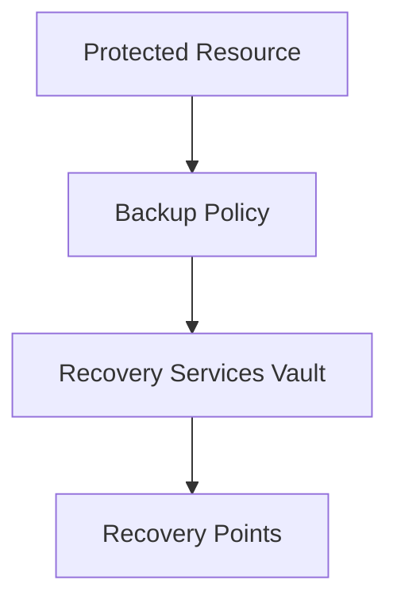

# 💾 Azure Backup

> Backup and recovery services for Azure and hybrid workloads.

---

# 📚 Table of Contents

- [� Azure Backup](#-azure-backup)
- [📚 Table of Contents](#-table-of-contents)
- [📌 Overview](#-overview)
- [🏗️ Azure Backup Architecture](#️-azure-backup-architecture)
- [🔑 Core Concepts](#-core-concepts)
- [⚙️ Backup Policies](#️-backup-policies)
  - [Policy Components](#policy-components)
- [📊 Backup Scenarios](#-backup-scenarios)
- [🧪 Azure CLI Examples](#-azure-cli-examples)
  - [Enable VM Backup](#enable-vm-backup)
- [🧪 PowerShell Examples](#-powershell-examples)
  - [Get Backup Jobs](#get-backup-jobs)
- [🚨 Common Issues](#-common-issues)
  - [Backup Agent Failure](#backup-agent-failure)
    - [Possible Causes](#possible-causes)
  - [Recovery Point Missing](#recovery-point-missing)
    - [Common Causes](#common-causes)
- [✅ Best Practices](#-best-practices)
- [📖 References](#-references)

---

# 📌 Overview

Azure Backup provides secure and scalable backup services for Azure resources.

Supported workloads include:

- Virtual Machines
- Azure Files
- SQL Server
- SAP HANA

---

# 🏗️ Azure Backup Architecture



---

# 🔑 Core Concepts

| Component | Description |
|---|---|
| Backup Policy | Schedule and retention |
| Recovery Point | Backup snapshot |
| Soft Delete | Deleted backup protection |
| Instant Restore | Fast recovery capability |

---

# ⚙️ Backup Policies

## Policy Components

- Backup schedule
- Retention duration
- Snapshot frequency
- Long-term retention

---

# 📊 Backup Scenarios

| Scenario | Example |
|---|---|
| Daily VM Backup | Production VM |
| Long-Term Retention | Compliance |
| File Recovery | Azure Files restore |

---

# 🧪 Azure CLI Examples

## Enable VM Backup

```bash
az backup protection enable-for-vm \
  --resource-group Production-RG \
  --vault-name Prod-RecoveryVault \
  --vm WebVM01
```

---

# 🧪 PowerShell Examples

## Get Backup Jobs

```powershell
Get-AzRecoveryServicesBackupJob
```

---

# 🚨 Common Issues

## Backup Agent Failure

### Possible Causes

- Extension issue
- VM connectivity
- Outdated agent

---

## Recovery Point Missing

### Common Causes

- Retention policy expired
- Failed backup jobs

---

# ✅ Best Practices

- Configure long-term retention
- Test restores regularly
- Monitor failed jobs
- Enable soft delete
- Separate backup policies by workload

---

# 📖 References

- [Azure Backup Documentation](https://learn.microsoft.com/en-us/azure/backup/backup-overview?utm_source=chatgpt.com)
- [Azure VM Backup Documentation](https://learn.microsoft.com/en-us/azure/backup/backup-azure-vms-introduction?utm_source=chatgpt.com)
- [Azure Backup Best Practices](https://learn.microsoft.com/en-us/azure/backup/guidance-best-practices?utm_source=chatgpt.com)

---