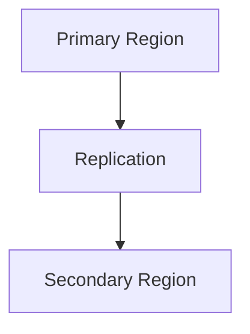

# 🌪️ Disaster Recovery

> Enterprise disaster recovery planning and implementation in Azure.

---

# 📚 Table of Contents

- [🌪️ Disaster Recovery](#️-disaster-recovery)
- [📚 Table of Contents](#-table-of-contents)
- [📌 Overview](#-overview)
- [🏗️ DR Architecture](#️-dr-architecture)
- [🔑 Core Concepts](#-core-concepts)
- [⚙️ Disaster Recovery Planning](#️-disaster-recovery-planning)
  - [Key Planning Areas](#key-planning-areas)
- [📊 DR Strategies](#-dr-strategies)
- [🧪 DR Scenarios](#-dr-scenarios)
- [🚨 Common Issues](#-common-issues)
  - [DR Plan Failure](#dr-plan-failure)
    - [Possible Causes](#possible-causes)
  - [Recovery Delays](#recovery-delays)
    - [Common Causes](#common-causes)
- [✅ Best Practices](#-best-practices)
- [📖 References](#-references)

---

# 📌 Overview

Disaster Recovery (DR) ensures business continuity during outages and catastrophic failures.

Azure DR solutions protect against:

- Regional outages
- Hardware failures
- Data corruption
- Ransomware attacks

---

# 🏗️ DR Architecture

---

# 🔑 Core Concepts

| Component | Description |
|---|---|
| RPO | Recovery Point Objective |
| RTO | Recovery Time Objective |
| Failover | Switch to DR site |
| Failback | Return to primary site |

---

# ⚙️ Disaster Recovery Planning

## Key Planning Areas

- Business impact analysis
- Recovery priorities
- Backup strategy
- Replication strategy
- Testing procedures

---

# 📊 DR Strategies

| Strategy | Description |
|---|---|
| Backup & Restore | Lowest cost |
| Pilot Light | Minimal standby |
| Warm Standby | Partial environment |
| Active-Active | Full redundancy |

---

# 🧪 DR Scenarios

| Scenario | Response |
|---|---|
| Regional Failure | Failover |
| Data Corruption | Restore backup |
| VM Failure | Recover VM |

---

# 🚨 Common Issues

## DR Plan Failure

### Possible Causes

- Missing dependencies
- Incomplete testing
- Replication lag

---

## Recovery Delays

### Common Causes

- Large restore operations
- Insufficient capacity
- Network bottlenecks

---

# ✅ Best Practices

- Define RPO/RTO clearly
- Test DR regularly
- Replicate critical workloads
- Use Availability Zones
- Document recovery procedures

---

# 📖 References

- [Azure Disaster Recovery Documentation](https://learn.microsoft.com/en-us/azure/site-recovery/site-recovery-overview?utm_source=chatgpt.com)
- [Azure Reliability Documentation](https://learn.microsoft.com/en-us/azure/reliability/overview?utm_source=chatgpt.com)
- [Cloud Adoption Framework DR Guidance](https://learn.microsoft.com/en-us/azure/cloud-adoption-framework/scenarios/business-continuity/disaster-recovery?utm_source=chatgpt.com)

---