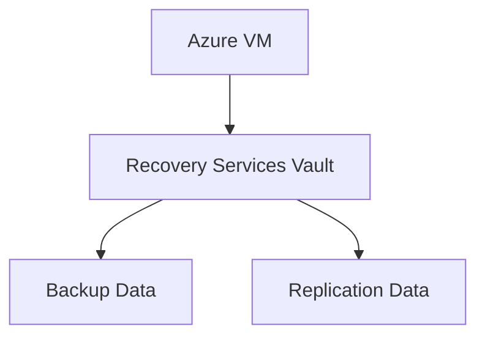

# 🛡️ Recovery Services Vault

> Centralized backup and disaster recovery management in Azure.

---

# 📚 Table of Contents

- [�️ Recovery Services Vault](#️-recovery-services-vault)
- [📚 Table of Contents](#-table-of-contents)
- [📌 Overview](#-overview)
- [🏗️ Recovery Services Vault Architecture](#️-recovery-services-vault-architecture)
- [🔑 Core Concepts](#-core-concepts)
- [⚙️ Vault Administration](#️-vault-administration)
  - [Common Tasks](#common-tasks)
- [📊 Supported Workloads](#-supported-workloads)
- [🧪 Azure CLI Examples](#-azure-cli-examples)
  - [Create Recovery Services Vault](#create-recovery-services-vault)
- [🧪 PowerShell Examples](#-powershell-examples)
  - [Create Vault](#create-vault)
- [🚨 Common Issues](#-common-issues)
  - [Backup Job Failure](#backup-job-failure)
    - [Possible Causes](#possible-causes)
  - [Restore Failure](#restore-failure)
    - [Common Causes](#common-causes)
- [✅ Best Practices](#-best-practices)
- [📖 References](#-references)

---

# 📌 Overview

Recovery Services Vault provides centralized management for:

- Azure Backup
- Azure Site Recovery
- VM protection
- Disaster recovery operations

---

# 🏗️ Recovery Services Vault Architecture



---

# 🔑 Core Concepts

| Component | Description |
|---|---|
| Vault | Backup management container |
| Backup Policy | Protection configuration |
| Recovery Point | Backup snapshot |
| Replication | Disaster recovery sync |

---

# ⚙️ Vault Administration

## Common Tasks

- Create vaults
- Configure backup policies
- Enable replication
- Monitor backup jobs
- Perform restores

---

# 📊 Supported Workloads

| Workload | Supported |
|---|---|
| Azure VMs | ✅ |
| SQL Server | ✅ |
| Azure Files | ✅ |
| On-Prem Servers | ✅ |

---

# 🧪 Azure CLI Examples

## Create Recovery Services Vault

```bash
az backup vault create \
  --resource-group Production-RG \
  --name Prod-RecoveryVault
```

---

# 🧪 PowerShell Examples

## Create Vault

```powershell
New-AzRecoveryServicesVault `
-Name "Prod-RecoveryVault" `
-ResourceGroupName "Production-RG"
```

---

# 🚨 Common Issues

## Backup Job Failure

### Possible Causes

- VM agent issue
- Network connectivity
- Storage quota issue

---

## Restore Failure

### Common Causes

- Missing recovery point
- RBAC permission issue
- Vault lock conflict

---

# ✅ Best Practices

- Use separate vaults for production
- Enable soft delete
- Monitor backup jobs
- Test restores regularly
- Protect vault access with RBAC

---

# 📖 References

- [Recovery Services Vault Documentation](https://learn.microsoft.com/en-us/azure/backup/backup-azure-recovery-services-vault-overview?utm_source=chatgpt.com)
- [Azure Backup Documentation](https://learn.microsoft.com/en-us/azure/backup/backup-overview?utm_source=chatgpt.com)

---