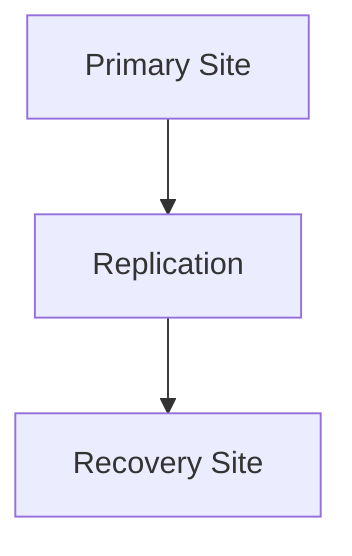

# 🌍 Azure Site Recovery

> Disaster recovery and workload replication for Azure and hybrid environments.

---

# 📚 Table of Contents

- [🌍 Azure Site Recovery](#-azure-site-recovery)
- [📚 Table of Contents](#-table-of-contents)
- [📌 Overview](#-overview)
- [🏗️ Site Recovery Architecture](#️-site-recovery-architecture)
- [🔑 Core Concepts](#-core-concepts)
- [⚙️ Replication Components](#️-replication-components)
  - [Common Tasks](#common-tasks)
- [📊 Failover Types](#-failover-types)
- [🧪 Azure CLI Examples](#-azure-cli-examples)
  - [List Recovery Vaults](#list-recovery-vaults)
- [🚨 Common Issues](#-common-issues)
  - [Replication Health Critical](#replication-health-critical)
    - [Possible Causes](#possible-causes)
  - [Failover Failure](#failover-failure)
    - [Common Causes](#common-causes)
- [✅ Best Practices](#-best-practices)
- [📖 References](#-references)

---

# 📌 Overview

Azure Site Recovery (ASR) replicates workloads for business continuity and disaster recovery.

ASR supports:

- Azure-to-Azure replication
- VMware replication
- Hyper-V replication
- Physical server replication

---

# 🏗️ Site Recovery Architecture



---

# 🔑 Core Concepts

| Component | Description |
|---|---|
| Replication Policy | Recovery configuration |
| Failover | Switch to recovery site |
| Failback | Return to primary site |
| Recovery Plan | Automated DR workflow |

---

# ⚙️ Replication Components

## Common Tasks

- Enable replication
- Configure policies
- Run test failover
- Perform planned failover
- Monitor replication health

---

# 📊 Failover Types

| Type | Purpose |
|---|---|
| Test Failover | Validation |
| Planned Failover | Controlled migration |
| Unplanned Failover | Disaster recovery |

---

# 🧪 Azure CLI Examples

## List Recovery Vaults

```bash
az backup vault list \
  --resource-group Production-RG
```

---

# 🚨 Common Issues

## Replication Health Critical

### Possible Causes

- Network connectivity
- Replication lag
- Storage issue

---

## Failover Failure

### Common Causes

- Missing dependencies
- Replication inconsistency
- Capacity limitation

---

# ✅ Best Practices

- Test failovers regularly
- Use recovery plans
- Monitor replication continuously
- Separate DR environments
- Document recovery procedures

---

# 📖 References

- [Azure Site Recovery Documentation](https://learn.microsoft.com/en-us/azure/site-recovery/site-recovery-overview?utm_source=chatgpt.com)
- [Azure-to-Azure Disaster Recovery Documentation](https://learn.microsoft.com/en-us/azure/site-recovery/azure-to-azure-about-networking?utm_source=chatgpt.com)
- [ASR Best Practices](https://learn.microsoft.com/en-us/azure/site-recovery/site-recovery-best-practices?utm_source=chatgpt.com)

---