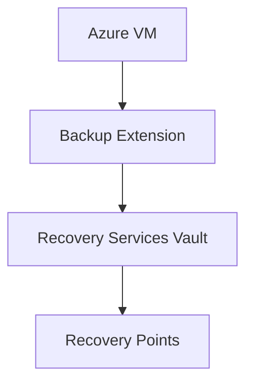

# 🖥️ VM Backup

> Protect Azure Virtual Machines using Azure Backup services.

---

# 📚 Table of Contents

- [�️ VM Backup](#️-vm-backup)
- [📚 Table of Contents](#-table-of-contents)
- [📌 Overview](#-overview)
- [🏗️ VM Backup Architecture](#️-vm-backup-architecture)
- [🔑 Core Concepts](#-core-concepts)
- [⚙️ Backup Configuration](#️-backup-configuration)
  - [Common Tasks](#common-tasks)
- [📊 Restore Options](#-restore-options)
- [🧪 Azure CLI Examples](#-azure-cli-examples)
  - [Trigger Backup](#trigger-backup)
- [🚨 Common Issues](#-common-issues)
  - [VM Backup Extension Failed](#vm-backup-extension-failed)
    - [Possible Causes](#possible-causes)
  - [Restore Operation Slow](#restore-operation-slow)
    - [Common Causes](#common-causes)
- [✅ Best Practices](#-best-practices)
- [📖 References](#-references)

---

# 📌 Overview

Azure VM Backup protects virtual machines against:

- Accidental deletion
- Corruption
- Ransomware
- Regional outages

---

# 🏗️ VM Backup Architecture



---

# 🔑 Core Concepts

| Component | Description |
|---|---|
| Snapshot | Point-in-time copy |
| Vault | Backup storage |
| Retention Policy | Backup lifecycle |
| Instant Restore | Rapid VM restore |

---

# ⚙️ Backup Configuration

## Common Tasks

- Enable backup
- Configure schedules
- Configure retention
- Restore files
- Restore full VMs

---

# 📊 Restore Options

| Restore Type | Usage |
|---|---|
| Full VM Restore | Disaster recovery |
| Disk Restore | Partial recovery |
| File Recovery | Single file restore |

---

# 🧪 Azure CLI Examples

## Trigger Backup

```bash
az backup protection backup-now \
  --resource-group Production-RG \
  --vault-name Prod-RecoveryVault
```

---

# 🚨 Common Issues

## VM Backup Extension Failed

### Possible Causes

- Extension corruption
- Connectivity issue
- Unsupported OS

---

## Restore Operation Slow

### Common Causes

- Large VM size
- Regional latency
- High storage load

---

# ✅ Best Practices

- Enable daily backups
- Use application-consistent snapshots
- Monitor backup health
- Test recovery procedures
- Protect backup vaults

---

# 📖 References

- [Azure VM Backup Documentation](https://learn.microsoft.com/en-us/azure/backup/backup-azure-vms-introduction?utm_source=chatgpt.com)
- [Azure VM Restore Documentation](https://learn.microsoft.com/en-us/azure/backup/backup-azure-arm-restore-vms?utm_source=chatgpt.com)
- [Azure Backup Best Practices](https://learn.microsoft.com/en-us/azure/backup/guidance-best-practices?utm_source=chatgpt.com)

---