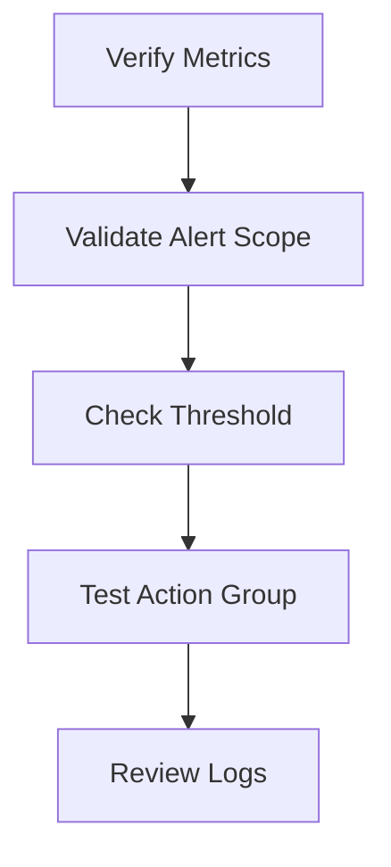

# 🚨 Azure Monitor Alerts Issues

> Troubleshooting Azure Monitor alert failures and monitoring inconsistencies.

---

# 📚 Table of Contents

- [� Azure Monitor Alerts Issues](#-azure-monitor-alerts-issues)
- [📚 Table of Contents](#-table-of-contents)
- [📌 Overview](#-overview)
- [🔍 Common Alert Problems](#-common-alert-problems)
- [⚙️ Troubleshooting Workflow](#️-troubleshooting-workflow)
- [🧪 Diagnostic Commands](#-diagnostic-commands)
  - [View Metric Definitions](#view-metric-definitions)
  - [List Alert Rules](#list-alert-rules)
- [📊 Common Root Causes](#-common-root-causes)
- [✅ Best Practices](#-best-practices)
- [📖 References](#-references)

---

# 📌 Overview

Azure Monitor alerts may fail to trigger due to configuration issues, metric ingestion delays, or scope problems.

This guide focuses on troubleshooting:

- Missing alerts
- Delayed alerts
- Alert storms
- Incorrect thresholds
- Action group failures

---

# 🔍 Common Alert Problems

| Problem | Description |
|---|---|
| Alert Not Triggering | No notification received |
| Delayed Alert | Trigger occurs too late |
| Duplicate Alerts | Multiple alerts generated |
| Missing Metrics | Monitoring data unavailable |

---

# ⚙️ Troubleshooting Workflow



---

# 🧪 Diagnostic Commands

## View Metric Definitions

```bash
az monitor metrics list-definitions \
  --resource WebVM01
```

## List Alert Rules

```bash
az monitor metrics alert list \
  --resource-group Production-RG
```

---

# 📊 Common Root Causes

| Issue | Root Cause |
|---|---|
| No Alert | Wrong scope |
| Delayed Alert | Long evaluation frequency |
| Alert Storm | Aggressive threshold |
| Missing Notification | Broken action group |

---

# ✅ Best Practices

- Use realistic thresholds
- Configure alert suppression
- Monitor action group health
- Test alerts regularly
- Centralize monitoring

---

# 📖 References

- [Azure Alerts Troubleshooting Documentation](https://learn.microsoft.com/en-us/azure/azure-monitor/alerts/alerts-troubleshoot?utm_source=chatgpt.com)
- [Azure Monitor Documentation](https://learn.microsoft.com/en-us/azure/azure-monitor/overview?utm_source=chatgpt.com)

---