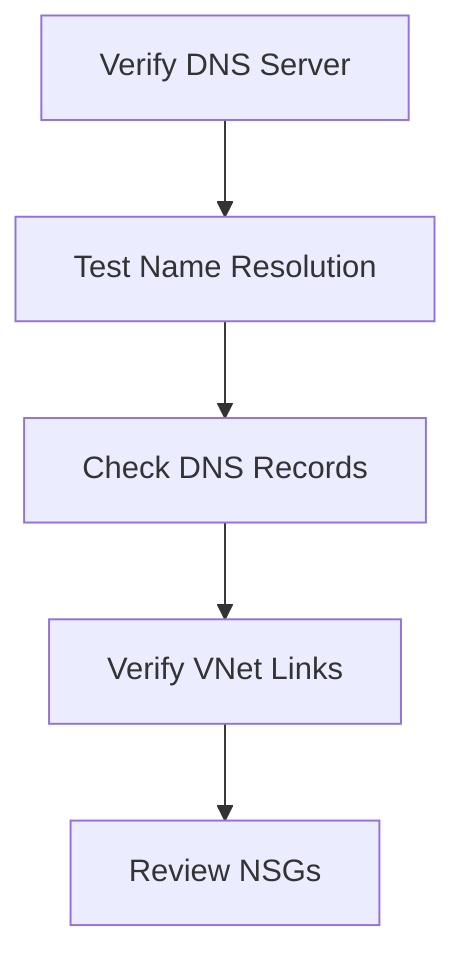

# 🌍 DNS Resolution Issues

> Troubleshooting DNS failures and name resolution problems in Azure.

---

# 📚 Table of Contents

- [🌍 DNS Resolution Issues](#-dns-resolution-issues)
- [📚 Table of Contents](#-table-of-contents)
- [📌 Overview](#-overview)
- [🔍 Common DNS Problems](#-common-dns-problems)
- [⚙️ Troubleshooting Workflow](#️-troubleshooting-workflow)
- [🧪 Diagnostic Commands](#-diagnostic-commands)
  - [Test DNS Resolution](#test-dns-resolution)
  - [Linux DNS Test](#linux-dns-test)
- [📊 Common Root Causes](#-common-root-causes)
- [✅ Best Practices](#-best-practices)
- [📖 References](#-references)

---

# 📌 Overview

DNS issues commonly affect Azure connectivity, application communication, and hybrid networking.

This guide covers troubleshooting for:

- Private DNS failures
- Public DNS failures
- Hybrid DNS issues
- VNet DNS configuration

---

# 🔍 Common DNS Problems

| Problem | Description |
|---|---|
| Hostname Not Resolving | DNS lookup failure |
| Slow Resolution | Delayed responses |
| Private DNS Failure | Internal names unresolved |
| Hybrid DNS Failure | On-prem integration issue |

---

# ⚙️ Troubleshooting Workflow



---

# 🧪 Diagnostic Commands

## Test DNS Resolution

```bash
nslookup contoso.com
```

## Linux DNS Test

```bash
dig contoso.com
```

---

# 📊 Common Root Causes

| Issue | Root Cause |
|---|---|
| DNS Timeout | Firewall issue |
| Incorrect Resolution | Wrong DNS server |
| Private Zone Failure | Missing VNet link |
| Hybrid Failure | DNS forwarder issue |

---

# ✅ Best Practices

- Use Azure Private DNS
- Configure DNS forwarders properly
- Monitor DNS latency
- Avoid manual DNS entries
- Document DNS architecture

---

# 📖 References

- [Azure DNS Troubleshooting Documentation](https://learn.microsoft.com/en-us/azure/dns/dns-troubleshoot?utm_source=chatgpt.com)
- [Azure Private DNS Documentation](https://learn.microsoft.com/en-us/azure/dns/private-dns-overview?utm_source=chatgpt.com)

---