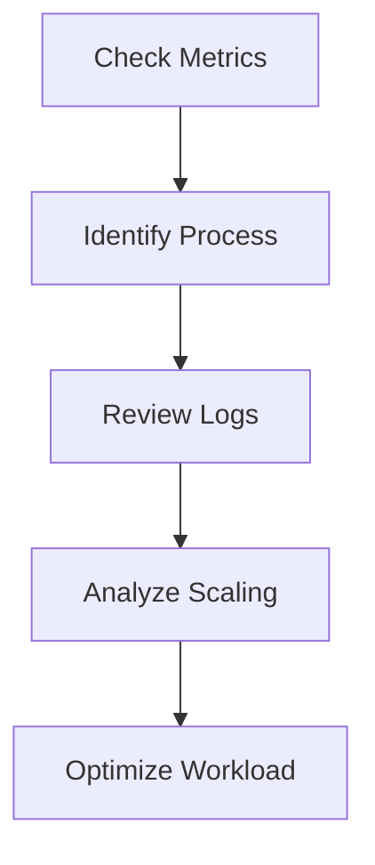

# 🔥 High CPU Issues

> Troubleshooting high CPU utilization in Azure workloads.

---

# 📚 Table of Contents

- [� High CPU Issues](#-high-cpu-issues)
- [📚 Table of Contents](#-table-of-contents)
- [📌 Overview](#-overview)
- [🔍 Common CPU Problems](#-common-cpu-problems)
- [⚙️ Troubleshooting Workflow](#️-troubleshooting-workflow)
- [🧪 Diagnostic Commands](#-diagnostic-commands)
  - [Linux CPU Usage](#linux-cpu-usage)
  - [Windows CPU Monitoring](#windows-cpu-monitoring)
- [📊 Common Root Causes](#-common-root-causes)
- [✅ Best Practices](#-best-practices)
- [📖 References](#-references)

---

# 📌 Overview

High CPU utilization can degrade application performance and impact workload stability.

This guide focuses on:

- VM CPU bottlenecks
- Application spikes
- Scaling issues
- Resource exhaustion

---

# 🔍 Common CPU Problems

| Problem | Description |
|---|---|
| Constant High CPU | Sustained workload pressure |
| CPU Spikes | Temporary utilization peaks |
| Slow Applications | Performance degradation |
| VM Unresponsive | Resource exhaustion |

---

# ⚙️ Troubleshooting Workflow



---

# 🧪 Diagnostic Commands

## Linux CPU Usage

```bash
top
```

## Windows CPU Monitoring

```powershell
Get-Process | Sort CPU -Descending
```

---

# 📊 Common Root Causes

| Issue | Root Cause |
|---|---|
| High CPU | Undersized VM |
| CPU Spikes | Scheduled jobs |
| Slow Response | Resource contention |
| VM Crash | Sustained overload |

---

# ✅ Best Practices

- Monitor baseline CPU usage
- Use autoscaling
- Optimize applications
- Resize VMs appropriately
- Configure alerts

---

# 📖 References

- [Azure VM Performance Troubleshooting Documentation](https://learn.microsoft.com/en-us/troubleshoot/azure/virtual-machines/windows/troubleshoot-performance-cpu-memory-issues?utm_source=chatgpt.com)
- [Azure Monitor Metrics Documentation](https://learn.microsoft.com/en-us/azure/azure-monitor/essentials/data-platform-metrics?utm_source=chatgpt.com)

---