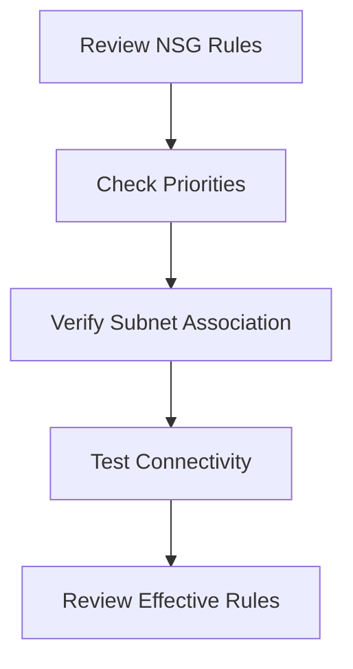

# 🚫 NSG Blocking Traffic

> Troubleshooting Azure Network Security Group traffic filtering issues.

---

# 📚 Table of Contents

- [� NSG Blocking Traffic](#-nsg-blocking-traffic)
- [📚 Table of Contents](#-table-of-contents)
- [📌 Overview](#-overview)
- [🔍 Common NSG Problems](#-common-nsg-problems)
- [⚙️ Troubleshooting Workflow](#️-troubleshooting-workflow)
- [🧪 Diagnostic Commands](#-diagnostic-commands)
  - [List NSG Rules](#list-nsg-rules)
  - [Test Connectivity](#test-connectivity)
- [📊 Common Root Causes](#-common-root-causes)
- [✅ Best Practices](#-best-practices)
- [📖 References](#-references)

---

# 📌 Overview

NSGs commonly block Azure traffic due to incorrect security rules or priorities.

This guide covers troubleshooting for:

- VM connectivity
- Application traffic
- Hybrid communication
- Inbound/outbound filtering

---

# 🔍 Common NSG Problems

| Problem | Description |
|---|---|
| VM Unreachable | Traffic denied |
| Port Access Failure | Incorrect NSG rule |
| Intermittent Traffic | Conflicting rules |
| Outbound Failure | Egress blocked |

---

# ⚙️ Troubleshooting Workflow



---

# 🧪 Diagnostic Commands

## List NSG Rules

```bash
az network nsg rule list \
  --resource-group Production-RG \
  --nsg-name Web-NSG
```

## Test Connectivity

```powershell
Test-NetConnection 10.0.1.4 -Port 443
```

---

# 📊 Common Root Causes

| Issue | Root Cause |
|---|---|
| Denied Traffic | Incorrect priority |
| App Failure | Missing outbound rule |
| Connectivity Timeout | NSG association issue |

---

# ✅ Best Practices

- Use least privilege rules
- Review effective security rules
- Avoid overly broad access
- Document NSG configurations
- Use Application Security Groups

---

# 📖 References

- [Azure NSG Troubleshooting Documentation](https://learn.microsoft.com/en-us/azure/virtual-network/diagnose-network-traffic-filter-problem?utm_source=chatgpt.com)
- [Azure NSG Documentation](https://learn.microsoft.com/en-us/azure/virtual-network/network-security-groups-overview?utm_source=chatgpt.com)

---