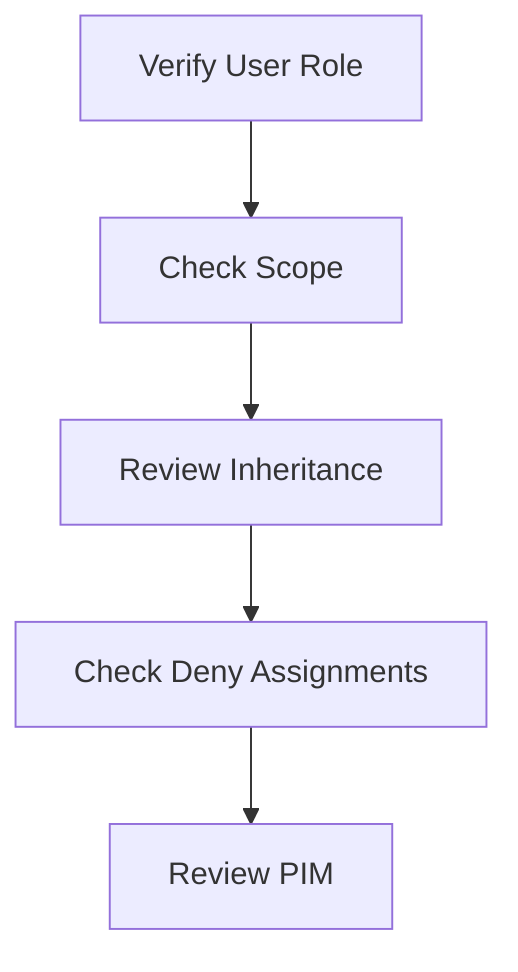

# 🔐 RBAC Issues

> Troubleshooting Azure Role-Based Access Control permission problems.

---

# 📚 Table of Contents

- [� RBAC Issues](#-rbac-issues)
- [📚 Table of Contents](#-table-of-contents)
- [📌 Overview](#-overview)
- [🔍 Common RBAC Problems](#-common-rbac-problems)
- [⚙️ Troubleshooting Workflow](#️-troubleshooting-workflow)
- [🧪 Diagnostic Commands](#-diagnostic-commands)
  - [List Role Assignments](#list-role-assignments)
  - [View Current Account](#view-current-account)
- [📊 Common Root Causes](#-common-root-causes)
- [✅ Best Practices](#-best-practices)
- [📖 References](#-references)

---

# 📌 Overview

RBAC issues commonly prevent users and applications from accessing Azure resources.

This guide focuses on troubleshooting:

- Access denied errors
- Missing subscriptions
- Scope inheritance issues
- PIM activation problems

---

# 🔍 Common RBAC Problems

| Problem | Description |
|---|---|
| Access Denied | Permission missing |
| Resource Invisible | Scope issue |
| PIM Failure | Activation issue |
| Role Not Inherited | Scope conflict |

---

# ⚙️ Troubleshooting Workflow



---

# 🧪 Diagnostic Commands

## List Role Assignments

```bash
az role assignment list \
  --assignee john@contoso.com
```

## View Current Account

```bash
az account show
```

---

# 📊 Common Root Causes

| Issue | Root Cause |
|---|---|
| Missing Access | Incorrect scope |
| No Subscription | Reader role missing |
| Role Not Working | PIM inactive |
| Access Conflict | Deny assignment |

---

# ✅ Best Practices

- Use groups for RBAC
- Apply least privilege
- Use PIM for admins
- Audit assignments regularly
- Avoid direct Owner assignments

---

# 📖 References

- [Azure RBAC Troubleshooting Documentation](https://learn.microsoft.com/en-us/azure/role-based-access-control/troubleshooting?utm_source=chatgpt.com)
- [Azure RBAC Documentation](https://learn.microsoft.com/en-us/azure/role-based-access-control/overview?utm_source=chatgpt.com)

---