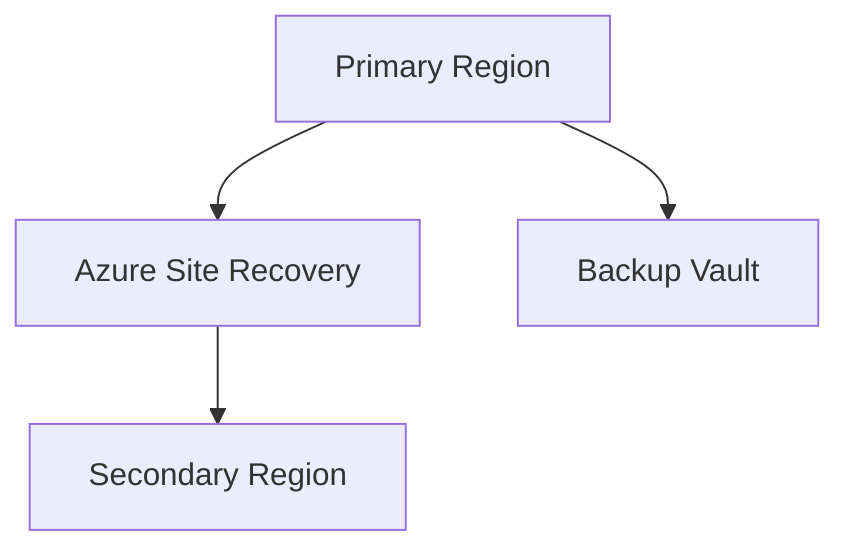

# 🌪️ Disaster Recovery Architecture

> Enterprise disaster recovery architecture design for Azure workloads.

---

# 📚 Table of Contents

- [🌪️ Disaster Recovery Architecture](#️-disaster-recovery-architecture)
- [📚 Table of Contents](#-table-of-contents)
- [📌 Overview](#-overview)
- [🏗️ Architecture Diagram](#️-architecture-diagram)
- [🔑 Core Concepts](#-core-concepts)
- [⚙️ DR Components](#️-dr-components)
  - [Core Services](#core-services)
- [📊 Recovery Strategies](#-recovery-strategies)
- [🧪 DR Scenarios](#-dr-scenarios)
- [🚨 Common Issues](#-common-issues)
  - [Failover Delays](#failover-delays)
    - [Possible Causes](#possible-causes)
  - [Incomplete Recovery](#incomplete-recovery)
    - [Common Causes](#common-causes)
- [✅ Best Practices](#-best-practices)
- [📖 References](#-references)

---

# 📌 Overview

Disaster Recovery architectures ensure workload resiliency during outages and catastrophic failures.

Azure DR architectures focus on:

- Replication
- Failover
- Business continuity
- Regional resiliency

---

# 🏗️ Architecture Diagram

---

# 🔑 Core Concepts

| Component | Description |
|---|---|
| RPO | Data loss tolerance |
| RTO | Recovery time objective |
| Replication | Data synchronization |
| Failover | Recovery operation |

---

# ⚙️ DR Components

## Core Services

- Azure Site Recovery
- Azure Backup
- Recovery Services Vault
- Availability Zones

---

# 📊 Recovery Strategies

| Strategy | Description |
|---|---|
| Backup & Restore | Low-cost recovery |
| Pilot Light | Minimal standby |
| Warm Standby | Partial workload |
| Active-Active | Full redundancy |

---

# 🧪 DR Scenarios

- Regional outage
- Datacenter failure
- Application corruption
- Ransomware recovery

---

# 🚨 Common Issues

## Failover Delays

### Possible Causes

- Replication lag
- Capacity shortage
- DNS propagation

---

## Incomplete Recovery

### Common Causes

- Missing dependencies
- Inconsistent backups
- Recovery plan gaps

---

# ✅ Best Practices

- Define RPO/RTO clearly
- Test failovers regularly
- Replicate critical workloads
- Use Availability Zones
- Document recovery runbooks

---

# 📖 References

- [Azure Site Recovery Documentation](https://learn.microsoft.com/en-us/azure/site-recovery/site-recovery-overview?utm_source=chatgpt.com)
- [Azure Reliability Documentation](https://learn.microsoft.com/en-us/azure/reliability/overview?utm_source=chatgpt.com)
- [Azure Disaster Recovery Guidance](https://learn.microsoft.com/en-us/azure/cloud-adoption-framework/scenarios/business-continuity/disaster-recovery?utm_source=chatgpt.com)

---