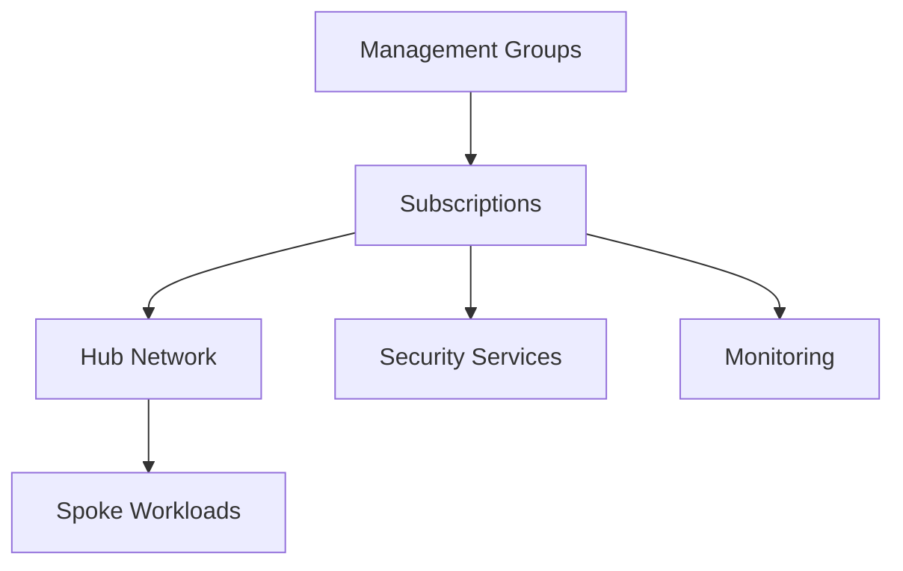

# 🏢 Enterprise Landing Zone Architecture

> Enterprise-scale Azure governance and platform foundation architecture.

---

# 📚 Table of Contents

- [🏢 Enterprise Landing Zone Architecture](#-enterprise-landing-zone-architecture)
- [📚 Table of Contents](#-table-of-contents)
- [📌 Overview](#-overview)
- [🏗️ Architecture Diagram](#️-architecture-diagram)
- [🔑 Core Concepts](#-core-concepts)
- [⚙️ Landing Zone Components](#️-landing-zone-components)
  - [Core Areas](#core-areas)
- [📊 Governance Layers](#-governance-layers)
- [🧪 Enterprise Scenarios](#-enterprise-scenarios)
- [🚨 Common Issues](#-common-issues)
  - [Governance Drift](#governance-drift)
    - [Possible Causes](#possible-causes)
  - [Subscription Sprawl](#subscription-sprawl)
    - [Common Causes](#common-causes)
- [✅ Best Practices](#-best-practices)
- [📖 References](#-references)

---

# 📌 Overview

Azure Landing Zones provide enterprise-ready Azure environments with governance, networking, identity, and security foundations.

Landing Zones help organizations:

- Standardize deployments
- Enforce governance
- Scale securely
- Accelerate cloud adoption

---

# 🏗️ Architecture Diagram

---

# 🔑 Core Concepts

| Component | Description |
|---|---|
| Management Groups | Governance hierarchy |
| Hub-and-Spoke | Enterprise networking |
| Policy Enforcement | Governance controls |
| Centralized Monitoring | Operational visibility |

---

# ⚙️ Landing Zone Components

## Core Areas

- Identity
- Networking
- Governance
- Security
- Monitoring
- Automation

---

# 📊 Governance Layers

| Layer | Purpose |
|---|---|
| Tenant | Enterprise governance |
| Management Group | Organizational structure |
| Subscription | Resource isolation |

---

# 🧪 Enterprise Scenarios

- Multi-subscription environments
- Enterprise governance
- Hybrid cloud adoption
- Regulatory compliance

---

# 🚨 Common Issues

## Governance Drift

### Possible Causes

- Missing policies
- Manual changes
- RBAC inconsistencies

---

## Subscription Sprawl

### Common Causes

- Poor governance planning
- Inconsistent standards

---

# ✅ Best Practices

- Use CAF-aligned landing zones
- Centralize governance
- Automate deployments
- Use policy inheritance
- Separate workloads by subscription

---

# 📖 References

- [Azure Landing Zones Documentation](https://learn.microsoft.com/en-us/azure/cloud-adoption-framework/ready/landing-zone/?utm_source=chatgpt.com)
- [Cloud Adoption Framework Documentation](https://learn.microsoft.com/en-us/azure/cloud-adoption-framework/?utm_source=chatgpt.com)
- [Enterprise-Scale Architecture Documentation](https://learn.microsoft.com/en-us/azure/cloud-adoption-framework/ready/enterprise-scale/?utm_source=chatgpt.com)

---